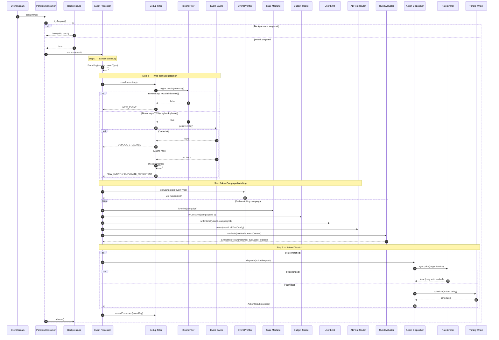
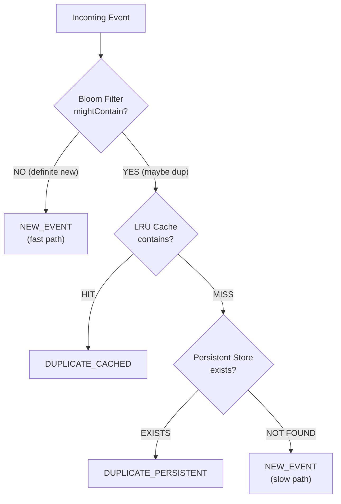
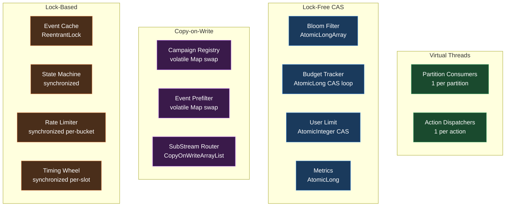

# TriggerFlow Architecture: Event-Driven Marketing Automation Engine

> **Single-source-of-truth map** for how all TriggerFlow components fit together.
> Platform: Java 21 — zero external dependencies, virtual threads, sealed types, immutable records.
> Performance targets: 1M+ events/sec throughput, <1ms p99 pipeline latency, three-tier deduplication with 99%+ Bloom filter skip rate.

---

## Table of Contents

1. [Design Philosophy](#1-design-philosophy)
2. [Component Architecture](#2-component-architecture)
3. [Request Lifecycle](#3-request-lifecycle)
4. [Component Responsibilities](#4-component-responsibilities)
5. [Data Flow Diagrams](#5-data-flow-diagrams)
6. [Threading Model](#6-threading-model)
7. [Design Decisions (ADR Format)](#7-design-decisions-adr-format)
8. [Integration Points](#8-integration-points)
9. [See Also](#9-see-also)

---

## 1. Design Philosophy

TriggerFlow is built on four non-negotiable principles. Every architectural choice traces back to at least one of them. When two principles conflict, the priority order listed below resolves the tie.

### Principle 1 — Lock-Free on the Hot Path

The event ingestion path — from partition consumer through Bloom filter check to campaign prefilter — must never block on a shared mutex. TriggerFlow enforces this with three mechanisms: `AtomicLongArray` with CAS loops for Bloom filter bit manipulation (zero locks, zero blocking), `ConcurrentHashMap` for dedup cache lookups (lock-free reads via `get()`), and `volatile` reference swaps for campaign registry updates (copy-on-write semantics). The only locks in the system are `ReentrantLock` on the LRU cache list (short critical section: 4 pointer assignments) and `synchronized` on the campaign state machine (exclusive transition serialization). Neither sits on the hot ingestion path. The result is sub-microsecond Bloom filter checks and <2µs cache hits under full load.

### Principle 2 — Three-Tier Probabilistic Deduplication

Exact deduplication at 1M events/sec requires either unbounded memory (store every event ID forever) or unbounded I/O (check persistent storage for every event). TriggerFlow solves this with a three-tier pipeline: a Bloom filter pre-screens 99%+ of duplicates in <1µs with zero I/O; an LRU cache catches the remaining 1% at O(1) with bounded memory; a persistent store provides the ground truth for the <0.1% that escape both tiers. The Bloom filter's false positive rate (0.1% at default configuration) is acceptable because false positives only cause a redundant cache lookup — they never cause a missed event. See [deduplication.md](deduplication.md) for the full probabilistic analysis.

### Principle 3 — Sealed Types for Exhaustive Safety

Every domain concept with a finite set of variants is modeled as a `sealed interface` or `enum`. `RuleNode` is sealed with four implementations (`AndNode`, `OrNode`, `NotNode`, `ConditionNode`). `ComparisonOp` is an enum with eight variants (`EQ`, `NEQ`, `GT`, `GTE`, `LT`, `LTE`, `IN`, `CONTAINS`). `CampaignStatus` is an enum with five states (`DRAFT`, `ACTIVE`, `PAUSED`, `COMPLETED`, `CANCELLED`). The Java compiler enforces exhaustive pattern matching on sealed types — adding a new `RuleNode` variant forces every evaluator switch expression to handle it. This eliminates the "forgot to handle the new case" class of bugs that is endemic in marketing automation systems with dozens of rule types.

### Principle 4 — Zero External Dependencies

TriggerFlow implements every algorithm from scratch: MurmurHash3 (32-bit), Bloom filter with Kirsch-Mitzenmacher double hashing, LRU cache with intrusive linked list, recursive descent JSON parser, recursive descent rule parser, hierarchical timing wheel (Varghese & Lauck, 1987), token bucket rate limiter with lazy refill, and exponential backoff with jitter. The only external dependency is SLF4J/Logback for structured logging. This eliminates supply chain risk for a security-critical system that processes user behavioral data and triggers real-world actions (push notifications, reward grants, payment compensations).

---

## 2. Component Architecture

The diagram below shows all seven modules and their directional dependencies. The system is organized as a pipeline: ingest → deduplicate → prefilter → evaluate → dispatch. The campaign module provides configuration state that the pipeline reads. Dashed arrows indicate background or asynchronous interactions.

```mermaid
graph TD
    classDef ingest fill:#1a3a5c,stroke:#4a90d9,color:#ffffff
    classDef dedup fill:#1a4a2e,stroke:#4aaa6e,color:#ffffff
    classDef rule fill:#4a2e1a,stroke:#d9804a,color:#ffffff
    classDef campaign fill:#3a1a4a,stroke:#9a4ad9,color:#ffffff
    classDef action fill:#3a3a1a,stroke:#d9d94a,color:#ffffff
    classDef engine fill:#4a1a1a,stroke:#d94a4a,color:#ffffff
    classDef common fill:#2a2a2a,stroke:#888888,color:#ffffff

    subgraph Common["Common Module"]
        EK["EventKey\n(eventId, eventType)"]:::common
        TFE["TriggerFlowEvent\n(record, 6 fields)"]:::common
        JC["JsonCodec\n(hand-rolled parser)"]:::common
        TFM["TriggerFlowMetrics\n(7 AtomicLong)"]:::common
    end

    subgraph Ingestion["Ingestion Module"]
        ES["Event Stream\n(interface)"]:::ingest
        PC["Partition Consumer\n(virtual thread)"]:::ingest
        CC["Consumer Coordinator\n(lifecycle)"]:::ingest
        SR["SubStream Router\n(CopyOnWriteArrayList)"]:::ingest
        BP["Backpressure Controller\n(Semaphore)"]:::ingest
    end

    subgraph Dedup["Deduplication Module"]
        BF["Bloom Prefilter\nMurmurHash3 + CAS"]:::dedup
        EC["Event Cache\nO(1) LRU"]:::dedup
        PD["Persistent Dedup\n(interface)"]:::dedup
        DF["Deduplication Filter\n(3-tier orchestrator)"]:::dedup
    end

    subgraph RuleEngine["Rule Engine Module"]
        RN["RuleNode\n(sealed AST)"]:::rule
        RP["Rule Parser\n(recursive descent)"]:::rule
        RE["Rule Evaluator\n(weighted short-circuit)"]:::rule
        EP["Evaluation Plan\n(pre-compiled)"]:::rule
        CTX["Event Context\n(dotted-path resolver)"]:::rule
    end

    subgraph Campaign["Campaign Module"]
        CMP["Campaign\n(record, 11 fields)"]:::campaign
        CR["Campaign Registry\n(volatile swap)"]:::campaign
        CSM["Campaign State Machine\n(transition validation)"]:::campaign
        BT["Budget Tracker\n(CAS loop)"]:::campaign
        ABT["AB Test Router\n(deterministic hash)"]:::campaign
        ULT["User Limit Tracker\n(nested CAS)"]:::campaign
        EPF["Event Prefilter\n(O(1) type index)"]:::campaign
    end

    subgraph Action["Action Module"]
        AD["Action Dispatcher\n(virtual thread)"]:::action
        AP["Action Pipeline\n(4-stage)"]:::action
        SRL["Service Rate Limiter\n(lazy-refill bucket)"]:::action
        TW["Timing Wheel\n(Varghese & Lauck)"]:::action
        DS["Delay Scheduler\n(100ms tick, 512 slots)"]:::action
        RP2["Retry Policy\n(exp backoff + jitter)"]:::action
    end

    subgraph Engine["Engine Module"]
        TFEng["TriggerFlow Engine\n(lifecycle)"]:::engine
        TFEB["Engine Builder\n(fluent, 15+ options)"]:::engine
        EVP["Event Processor\n(5-step pipeline)"]:::engine
    end

    ES --> PC
    PC --> CC
    CC --> SR
    SR --> BP
    BP --> EVP

    EVP -->|"1. extract key"| EK
    EVP -->|"2. dedup check"| DF
    DF --> BF
    DF --> EC
    DF --> PD

    EVP -->|"3. prefilter"| EPF
    EPF --> CR

    EVP -->|"4a. status check"| CSM
    EVP -->|"4b. budget check"| BT
    EVP -->|"4c. user limit"| ULT
    EVP -->|"4d. AB test"| ABT
    EVP -->|"4e. rule eval"| RE
    RE --> RN
    RE --> CTX

    EVP -->|"5. dispatch"| AD
    AD --> AP
    AP --> SRL
    AP --> DS
    DS --> TW
    AD --> RP2

    TFEng --> CC
    TFEng --> EVP
    TFEB --> TFEng
```

---

## 3. Request Lifecycle

The sequence below traces a single event from partition consumption through rule evaluation to action dispatch. The five-step pipeline in `EventProcessor` is the core execution path.

---

## 4. Component Responsibilities

### 4.1 Common Module

Shared types used across all modules. Every type is either a `record` (immutable value) or an `enum` (finite variants).

| Component | Responsibility | Key Invariant |
|---|---|---|
| `EventKey` | Immutable `(eventId, eventType)` pair | Non-null via compact constructor |
| `TriggerFlowEvent` | Core event entity (6 fields) | Payload defensively copied to unmodifiable `Map` |
| `EventType` | Known event types enum | RIDE_COMPLETED, PAYMENT_SUCCEEDED, ORDER_PLACED, etc. |
| `TriggerFlowConfig` | Immutable configuration with defaults | 4 parallelism, 24h dedup window, 1M cache entries, 0.001 FPR |
| `JsonCodec` | Hand-rolled recursive descent parser + serializer | ~500 LOC; handles Unicode escapes, number types, error positions |
| `TriggerFlowMetrics` | 7 `AtomicLong` counters | Lock-free reads and writes; snapshot-capable |

### 4.2 Ingestion Module

Partitioned event stream consumption with backpressure and type-based routing.

| Component | Responsibility | Concurrency Model |
|---|---|---|
| `EventStream` | Interface: `poll()`, `commit()`, `partition()` | Implemented by Kafka consumer or in-memory test double |
| `PartitionConsumer` | One virtual thread per partition | `volatile running` flag + interrupt for shutdown |
| `ConsumerCoordinator` | Creates/starts/stops all consumers | Aggregates consumed count via `AtomicLong` |
| `SubStreamRouter` | Routes events to type-specific handlers | `CopyOnWriteArrayList` per event type (lock-free reads) |
| `BackpressureController` | Admission control via `Semaphore` | Fair ordering (`Semaphore(max, true)`) prevents starvation |

### 4.3 Deduplication Module

Three-tier probabilistic and exact deduplication. See [deduplication.md](deduplication.md) for the full design.

| Component | Responsibility | Performance |
|---|---|---|
| `BloomPrefilter` | Probabilistic pre-screen via MurmurHash3 + CAS | <1µs per check; 0.1% FPR at default config |
| `EventCache` | O(1) LRU with `ReentrantLock` + `ConcurrentHashMap` | ~2µs per hit; bounded memory |
| `PersistentDedup` | Interface for durable dedup (Redis/DB in production) | Millisecond range; called for <0.1% of events |
| `DeduplicationFilter` | Orchestrates Bloom → cache → persistent | Returns `NEW_EVENT`, `DUPLICATE_CACHED`, or `DUPLICATE_PERSISTENT` |

### 4.4 Rule Engine Module

AST-based rule evaluation with weighted short-circuit optimization. See [rule-engine.md](rule-engine.md) for the full design.

| Component | Responsibility | Key Algorithm |
|---|---|---|
| `RuleNode` | Sealed interface: And, Or, Not, Condition | Immutable AST with `maxWeight()` for cost ordering |
| `RuleParser` | Recursive descent from JSON `Map` → AST | `RuleParseException` with context |
| `RuleEvaluator` | Tree-walking interpreter with short-circuit | Sort children by weight ascending; skip after first decisive result |
| `EvaluationPlan` | Pre-compiled optimization (reorder once, reuse) | Builds new AST with children sorted by `DataSource` weight |
| `EventContext` | Dotted-path field resolver | `payload.country`, `event.userId`, `enriched.tier` |
| `ComparisonOp` | 8 comparison operators | Overloaded for `double`, `String`, `Object` |
| `DataSource` | Enum with weights: MEMORY(1), DATABASE(10), EXTERNAL_SERVICE(100) | Drives cost-based evaluation ordering |

### 4.5 Campaign Module

Campaign state management, budgeting, A/B testing, and user rate limiting. See [campaign-and-actions.md](campaign-and-actions.md) for the full design.

| Component | Responsibility | Concurrency Model |
|---|---|---|
| `Campaign` | Immutable record (11 fields) | Copy-on-write via `withStatus()` |
| `CampaignRegistry` | `volatile Map` with atomic swap | Lock-free reads; copy-on-write mutations |
| `CampaignStateMachine` | Validates DRAFT→ACTIVE→PAUSED→COMPLETED transitions | `synchronized` for exclusive transition serialization |
| `BudgetTracker` | `ConcurrentHashMap<id, AtomicLong>` with CAS | High-limit optimization: skip tracking if remaining > 100K |
| `ABTestRouter` | Deterministic hash → 10K buckets → variant assignment | Stable: same userId always gets same variant |
| `UserLimitTracker` | Nested `ConcurrentHashMap` + `AtomicInteger` with CAS | Per-user isolation without global locks |
| `EventPrefilter` | `volatile Map<eventType, List<Campaign>>` | O(1) lookup; atomic rebuild on campaign change |

### 4.6 Action Module

Action dispatch with rate limiting, delayed scheduling, and retry. See [campaign-and-actions.md](campaign-and-actions.md) for timing wheel details.

| Component | Responsibility | Key Algorithm |
|---|---|---|
| `ActionDispatcher` | Virtual thread per dispatch + retry | `CompletableFuture<ActionResult>` |
| `ActionPipeline` | 4-stage: validate → rate-limit → delay-or-dispatch → result | Synchronous blocking via `.join()` |
| `ServiceRateLimiter` | Per-service lazy-refill token bucket | O(1) acquire; no background threads |
| `TimingWheel` | Hierarchical wheel (100ms tick, 512 slots) | O(1) insert/cancel; Varghese & Lauck, 1987 |
| `DelayScheduler` | Wraps timing wheel with scheduling API | Fires immediately if deadline has passed |
| `RetryPolicy` | Exponential backoff with 10% jitter | `delay = initial × 2^attempt × (1 ± 0.1 × random)` |
| `DownstreamClient` | Interface for HTTP/gRPC execution | In-memory test double provided |

### 4.7 Engine Module

Wiring, lifecycle management, and the core 5-step pipeline.

| Component | Responsibility |
|---|---|
| `TriggerFlowEngine` | Main entry point: `start()`, `stop()`, `metrics()` |
| `TriggerFlowEngineBuilder` | Fluent builder with 15+ configurable options |
| `EventProcessor` | 5-step pipeline: extract → dedup → prefilter → evaluate → dispatch |

---

## 5. Data Flow Diagrams

### 5.1 End-to-End Event Pipeline

### 5.2 Deduplication Decision Tree

---

## 6. Threading Model

TriggerFlow uses four distinct concurrency strategies:

| Component | Strategy | Rationale |
|---|---|---|
| Bloom filter | Lock-free CAS on `AtomicLongArray` | Millions of concurrent adds; zero blocking |
| Event cache | `ReentrantLock` on list + `ConcurrentHashMap` | Readers don't block; writers serialize briefly |
| Campaign registry | Volatile swap of immutable `Map` | Lock-free reads; atomic copy-on-write mutations |
| Budget tracker | CAS loop + high-limit skip (>100K) | Avoids contention for high-budget campaigns |
| User limiter | Nested `ConcurrentHashMap` + `AtomicInteger` CAS | Per-user isolation without global locks |
| Rate limiter | `synchronized` per bucket (lazy refill) | One lock per service; no background threads |
| Timing wheel | `synchronized` per slot list | Slot contention is low; overflow creation is rare |
| Metrics | `AtomicLong` counters | Lock-free reads and writes everywhere |
| Ingestion | Virtual threads + `Semaphore` + `CopyOnWriteArrayList` | No OS thread exhaustion; fair backpressure |

---

## 7. Design Decisions (ADR Format)

| Decision | Context | Choice | Consequences | Reference |
|---|---|---|---|---|
| Three-tier deduplication | Exact dedup at 1M/sec needs unbounded memory or I/O | Bloom → LRU cache → persistent store | 99%+ filtered in <1µs; 0.1% FPR acceptable | *DDIA* (Kleppmann), Ch. 11 |
| MurmurHash3 from scratch | Bloom filter needs fast, well-distributed non-crypto hash | 32-bit MurmurHash3 with Kirsch-Mitzenmacher double hashing | ~50ns per hash; proven distribution | Kirsch & Mitzenmacher, 2006 |
| Sealed `RuleNode` AST | Rule evaluation must be extensible yet type-safe | 4 sealed record variants with exhaustive matching | Compiler catches missing cases; immutable by construction | *Effective Java* (Bloch), Item 17 |
| Weighted short-circuit evaluation | Rules reference MEMORY, DATABASE, EXTERNAL_SERVICE sources | Sort children by `DataSource` weight ascending | Cheap checks first; expensive checks skipped when possible | Query optimizer principle |
| Copy-on-write campaign registry | Reads far outnumber writes; writes must be atomic | Volatile `Map` reference swapped on mutation | Lock-free reads; write creates full copy | *JCIP* (Goetz), Ch. 3 |
| Hierarchical timing wheel | Delayed actions need O(1) scheduling | 100ms tick, 512 slots, lazy overflow wheels | ~51s coverage per wheel; hierarchical for longer delays | Varghese & Lauck, 1987 |
| Lazy-refill token bucket | Per-service rate limiting without background threads | Refill on access: `tokens += (now - last) × rate` | O(1) per acquire; no timer overhead | Token bucket algorithm |
| Deterministic A/B test routing | Same user must always see same variant | MurmurHash spread → 10K buckets → cumulative proportions | Stable assignment; no state required | Consistent hashing variant |
| Hand-rolled JSON parser | Zero external dependencies; control error reporting | Recursive descent with position tracking | ~500 LOC; handles full JSON spec including Unicode escapes | JSON RFC 8259 |
| Virtual threads per partition | Partition consumers must scale without pool tuning | `Thread.ofVirtual().start()` per partition | Thousands of partitions without OS thread exhaustion | JEP 444 (Loom) |

---

## 8. Integration Points

### 8.1 TurboMQ Integration

The `EventStream` interface is TriggerFlow's abstraction over event sources. In production, `EventStream` implementations wrap TurboMQ partition consumers. The `commit(EventKey)` method maps to TurboMQ's offset commit for at-least-once delivery semantics. The `BackpressureController`'s semaphore-based admission control prevents TriggerFlow from consuming faster than it can process, providing natural backpressure to TurboMQ's consumer group.

### 8.2 FlashCache Integration

The `PersistentDedup` interface is TriggerFlow's abstraction over durable dedup storage. In production, a FlashCache-backed implementation provides sub-millisecond dedup lookups with the same O(1) algorithmic guarantees as TriggerFlow's in-memory cache. FlashCache's TTL-based expiry maps naturally to TriggerFlow's configurable dedup window (default 24 hours).

### 8.3 GrabFlow Integration

TriggerFlow is the marketing automation engine for GrabFlow's ride-sharing platform. Event types like `RIDE_COMPLETED`, `PAYMENT_SUCCEEDED`, and `ORDER_PLACED` flow from GrabFlow's microservices through TurboMQ into TriggerFlow's partition consumers. Campaign rules evaluate GrabFlow-specific conditions (rider tier, ride count, payment amount), and actions trigger GrabFlow's notification service (push notifications, reward grants, compensation flows).

### 8.4 AgentForge Integration

TriggerFlow's rule engine evaluates deterministic boolean conditions. For campaigns requiring natural language understanding (e.g., "user sentiment is negative" from support chat transcripts), the `EXTERNAL_SERVICE` data source in `EventContext` can invoke AgentForge agents for LLM-based classification. The `DataSource.EXTERNAL_SERVICE` weight (100) ensures these expensive calls are evaluated last via the weighted short-circuit optimizer.

---

## 9. See Also

- [deduplication.md](deduplication.md) — Bloom filter, MurmurHash3, LRU cache, three-tier pipeline
- [rule-engine.md](rule-engine.md) — Sealed AST, recursive descent parsing, weighted short-circuit evaluation
- [campaign-and-actions.md](campaign-and-actions.md) — State machine, budget tracking, A/B testing, timing wheel, rate limiting
- [architecture-tradeoffs.md](architecture-tradeoffs.md) — Six design trade-offs with cost-benefit analysis

---

*Last updated: 2026-04-03. Maintained by the TriggerFlow core team.*
