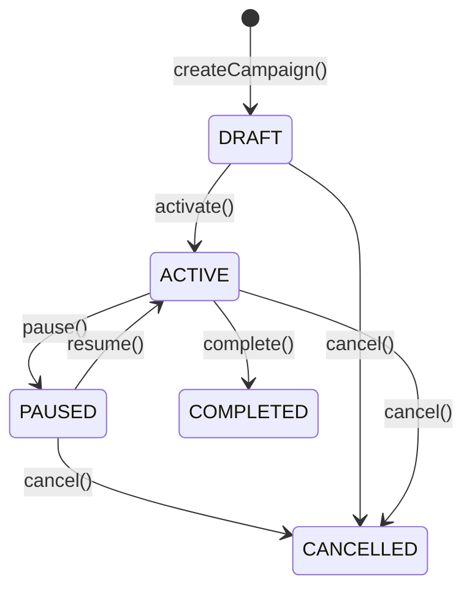
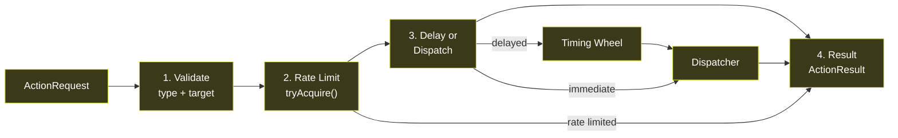
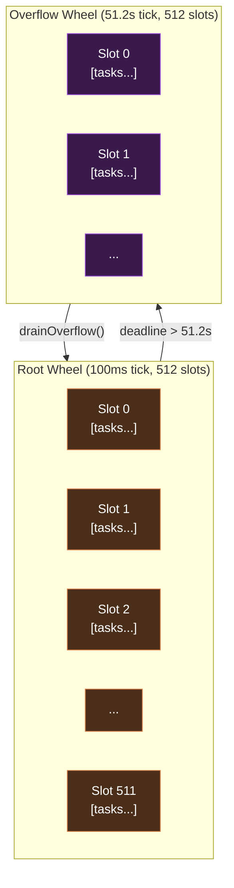

# TriggerFlow Campaigns and Action Dispatch

**State Machine, Budget Tracking, A/B Testing, Timing Wheel, and Rate Limiting**

> This document describes the design and implementation of TriggerFlow's campaign management and action dispatch subsystems — the modules responsible for campaign lifecycle governance, per-user rate limiting, deterministic A/B test routing, delayed action scheduling via a hierarchical timing wheel, and per-service rate limiting with lazy-refill token buckets. Intended for staff-level engineers evaluating the campaign or action internals.

---

## Table of Contents

1. [Overview](#1-overview)
2. [Campaign Model](#2-campaign-model)
   - 2.1 [Campaign Record](#21-campaign-record)
   - 2.2 [Campaign Registry (Copy-on-Write)](#22-campaign-registry-copy-on-write)
   - 2.3 [Event Prefilter](#23-event-prefilter)
3. [Campaign State Machine](#3-campaign-state-machine)
4. [Budget Tracker (CAS Loop)](#4-budget-tracker-cas-loop)
5. [A/B Test Router (Deterministic Hashing)](#5-ab-test-router-deterministic-hashing)
6. [User Limit Tracker](#6-user-limit-tracker)
7. [Action Dispatch Pipeline](#7-action-dispatch-pipeline)
   - 7.1 [Four-Stage Pipeline](#71-four-stage-pipeline)
   - 7.2 [Service Rate Limiter (Lazy-Refill Token Bucket)](#72-service-rate-limiter-lazy-refill-token-bucket)
   - 7.3 [Timing Wheel (Varghese & Lauck)](#73-timing-wheel-varghese--lauck)
   - 7.4 [Delay Scheduler](#74-delay-scheduler)
   - 7.5 [Retry with Exponential Backoff + Jitter](#75-retry-with-exponential-backoff--jitter)
8. [Failure Modes and Mitigations](#8-failure-modes-and-mitigations)
9. [Design Decisions (ADR)](#9-design-decisions-adr)
10. [See Also](#10-see-also)

---

## 1. Overview

The campaign and action modules span pipeline Steps 3–5 — everything after deduplication and before the downstream service call:

```mermaid
graph LR
    classDef campaign fill:#3a1a4a,stroke:#9a4ad9,color:#ffffff
    classDef action fill:#3a3a1a,stroke:#d9d94a,color:#ffffff

    EPF["Event Prefilter\nO(1) type lookup"]:::campaign
    CSM["State Machine\nstatus check"]:::campaign
    BT["Budget Tracker\nCAS loop"]:::campaign
    ULT["User Limit\nnested CAS"]:::campaign
    ABT["A/B Router\nhash buckets"]:::campaign
    RE["Rule Evaluator\nweighted AST"]:::campaign

    AP["Action Pipeline\n4-stage"]:::action
    SRL["Rate Limiter\ntoken bucket"]:::action
    DS["Delay Scheduler\ntiming wheel"]:::action
    AD["Action Dispatcher\nvirtual thread"]:::action
    RP["Retry Policy\nexp backoff"]:::action
    DC["Downstream\nService"]:::action

    EPF --> CSM --> BT --> ULT --> ABT --> RE
    RE -->|"matched"| AP
    AP --> SRL --> DS --> AD --> RP --> DC
```



---

## 2. Campaign Model

### 2.1 Campaign Record

A campaign is an immutable record with 11 fields. Mutation is expressed through copy-on-write factory methods.

```java
public record Campaign(
    String campaignId,
    String name,
    CampaignStatus status,
    EventType triggerEventType,
    RuleNode conditions,
    List<ActionDefinition> actions,
    BudgetConstraint budget,
    ABTestConfig abTest,
    Duration actionDelay,
    UserLimitation userLimit,
    Instant startTime,
    Instant endTime
) {
    public Campaign {
        actions = List.copyOf(actions);  // defensive copy
    }

    public Campaign withStatus(CampaignStatus newStatus) {
        return new Campaign(campaignId, name, newStatus, triggerEventType,
            conditions, actions, budget, abTest, actionDelay, userLimit,
            startTime, endTime);
    }
}
```

**Supporting types:**

| Type | Fields | Purpose |
|---|---|---|
| `ActionDefinition` | actionType, targetService, params | What to do when rule matches |
| `BudgetConstraint` | maxAmount, currency | Total spend limit; `unlimited()` factory |
| `ABTestConfig` | `Map<variant, proportion>` | Variant assignment; `disabled()` factory |
| `UserLimitation` | maxActionsPerUser, timeWindow | Per-user rate cap; `unlimited()` factory |

### 2.2 Campaign Registry (Copy-on-Write)

The `CampaignRegistry` stores all campaigns in a `volatile Map<String, Campaign>` with atomic swap semantics:

```java
public class CampaignRegistry {
    private volatile Map<String, Campaign> campaigns = Map.of();

    public Campaign get(String campaignId) {
        return campaigns.get(campaignId);  // lock-free read
    }

    public void register(Campaign campaign) {
        var copy = new HashMap<>(campaigns);
        copy.put(campaign.campaignId(), campaign);
        campaigns = Map.copyOf(copy);      // atomic swap
    }

    public void reload(List<Campaign> all) {
        campaigns = all.stream().collect(
            toUnmodifiableMap(Campaign::campaignId, identity())
        );  // atomic full replacement
    }
}
```

**Why copy-on-write?** Campaign reads happen on every event (1M/sec). Campaign writes happen on operator actions (a few per hour). Copy-on-write makes reads completely lock-free — the `volatile` keyword guarantees the reader sees the latest map reference, and `Map.copyOf()` produces an immutable map that is safe to read concurrently.

### 2.3 Event Prefilter

The `EventPrefilter` indexes active campaigns by their trigger event type for O(1) lookup:

```java
public class EventPrefilter {
    private volatile Map<EventType, List<Campaign>> index = Map.of();

    public List<Campaign> getCampaigns(EventType eventType) {
        return index.getOrDefault(eventType, List.of());  // O(1)
    }

    public void rebuild(Collection<Campaign> campaigns) {
        index = campaigns.stream()
            .filter(c -> c.status() == CampaignStatus.ACTIVE)
            .collect(groupingBy(Campaign::triggerEventType, toUnmodifiableList()));
    }
}
```

Without the prefilter, every event would need to iterate all campaigns — O(C) per event where C is the total campaign count. With the prefilter, only campaigns matching the event's type are evaluated — typically 1–5 campaigns per event type.

---

## 3. Campaign State Machine

The `CampaignStateMachine` validates state transitions using an explicit transition map:



```java
public class CampaignStateMachine {
    private static final Map<CampaignStatus, Set<CampaignStatus>> TRANSITIONS = Map.of(
        DRAFT,     Set.of(ACTIVE, CANCELLED),
        ACTIVE,    Set.of(PAUSED, COMPLETED, CANCELLED),
        PAUSED,    Set.of(ACTIVE, CANCELLED),
        COMPLETED, Set.of(),
        CANCELLED, Set.of()
    );

    public synchronized Campaign transition(String campaignId, CampaignStatus newStatus) {
        Campaign current = registry.get(campaignId);
        if (!TRANSITIONS.get(current.status()).contains(newStatus)) {
            throw new IllegalStateException(
                "Cannot transition from " + current.status() + " to " + newStatus);
        }
        Campaign updated = current.withStatus(newStatus);
        registry.register(updated);
        prefilter.rebuild(registry.all());
        return updated;
    }
}
```

**Why `synchronized`?** State transitions must be serialized — two concurrent `transition()` calls on the same campaign could produce conflicting states. The `synchronized` keyword ensures only one transition executes at a time. This is acceptable because transitions are rare (operator actions) and the critical section is short (two map operations + one rebuild).

**Terminal states:** `COMPLETED` and `CANCELLED` have no outgoing transitions. Once a campaign reaches either state, it cannot be reactivated — a new campaign must be created. This prevents accidental reactivation of expired campaigns.

---

## 4. Budget Tracker (CAS Loop)

The `BudgetTracker` uses `ConcurrentHashMap<String, AtomicLong>` with CAS loops for contention-free budget consumption:

```java
public class BudgetTracker {
    private final ConcurrentHashMap<String, AtomicLong> remaining = new ConcurrentHashMap<>();
    private static final long HIGH_LIMIT_THRESHOLD = 100_000;

    public boolean tryConsume(String campaignId, long amount) {
        AtomicLong budget = remaining.get(campaignId);
        if (budget == null) return true;  // no budget constraint

        // High-limit optimization: skip CAS for high-budget campaigns
        if (budget.get() > HIGH_LIMIT_THRESHOLD) {
            budget.addAndGet(-amount);
            return true;
        }

        // CAS loop for low-budget campaigns
        while (true) {
            long current = budget.get();
            if (current < amount) return false;  // budget exhausted
            if (budget.compareAndSet(current, current - amount)) return true;
            // CAS failed — another thread consumed; retry
        }
    }
}
```

**High-limit optimization:** Campaigns with >100,000 remaining budget skip the CAS loop entirely and use `addAndGet()` — an unconditional atomic decrement. This is safe because at 100K+ remaining, a brief overshoot from concurrent decrements is negligible (at most a few units over budget). The CAS loop only activates when the budget approaches zero, where exact tracking matters.

**Why CAS over `synchronized`?** At 1M events/sec, a `synchronized` budget check would serialize all events targeting the same campaign. CAS allows concurrent consumption with retry only on actual contention (two threads consuming the same campaign's budget simultaneously).

---

## 5. A/B Test Router (Deterministic Hashing)

The `ABTestRouter` assigns users to experiment variants using deterministic hashing — the same user always receives the same variant, with no persistent state required.

```java
public class ABTestRouter {
    private static final int BUCKET_COUNT = 10_000;

    public String route(String userId, ABTestConfig config) {
        if (config.isDisabled()) return null;  // no A/B test

        int bucket = Math.abs(spreadHash(userId.hashCode())) % BUCKET_COUNT;

        // Sorted variants for deterministic iteration order
        List<Map.Entry<String, Double>> variants = config.variants().entrySet()
            .stream()
            .sorted(Map.Entry.comparingByKey())
            .toList();

        double cumulative = 0.0;
        double bucketProportion = (double) bucket / BUCKET_COUNT;

        for (var entry : variants) {
            cumulative += entry.getValue();
            if (bucketProportion < cumulative) {
                return entry.getKey();
            }
        }
        return variants.get(variants.size() - 1).getKey();  // rounding fallback
    }

    private int spreadHash(int hash) {
        // Murmur-style bit spreading to avoid clustering
        hash ^= hash >>> 16;
        hash *= 0x85ebca6b;
        hash ^= hash >>> 13;
        hash *= 0xc2b2ae35;
        hash ^= hash >>> 16;
        return hash;
    }
}
```

**Why 10,000 buckets?** 10K buckets provide 0.01% assignment granularity. A 50/50 A/B test assigns exactly 5000 buckets per variant. A 90/10 test assigns exactly 9000 and 1000 buckets. Fewer buckets (100) would produce visible quantization artifacts for fine-grained splits like 33.3/33.3/33.4. More buckets (1M) would not improve accuracy but waste comparison cycles.

**Why hash spreading?** Sequential user IDs (e.g., `user_1001`, `user_1002`) produce sequential `hashCode()` values, which map to adjacent buckets and produce skewed variant assignment. The Murmur-style spread function distributes sequential inputs uniformly across the bucket space.

**Determinism guarantee:** Given the same `userId` and `ABTestConfig`, the router always returns the same variant. No database, no Redis, no random numbers. This is critical for consistent user experience — a user who sees variant "A" on their first ride must see variant "A" on subsequent rides.

---

## 6. User Limit Tracker

The `UserLimitTracker` enforces per-user action limits using nested `ConcurrentHashMap` with `AtomicInteger` CAS:

```java
public class UserLimitTracker {
    // campaignId → userId → action count
    private final ConcurrentHashMap<String, ConcurrentHashMap<String, AtomicInteger>> limits
        = new ConcurrentHashMap<>();

    public boolean withinLimit(String userId, String campaignId, UserLimitation limit) {
        if (limit.isUnlimited()) return true;

        ConcurrentHashMap<String, AtomicInteger> campaignLimits =
            limits.computeIfAbsent(campaignId, k -> new ConcurrentHashMap<>());

        AtomicInteger count = campaignLimits.computeIfAbsent(userId, k -> new AtomicInteger(0));

        // CAS loop: atomically check and increment
        while (true) {
            int current = count.get();
            if (current >= limit.maxActionsPerUser()) return false;
            if (count.compareAndSet(current, current + 1)) return true;
        }
    }
}
```

**Nested isolation:** Each campaign has its own `ConcurrentHashMap`, and each user within that campaign has their own `AtomicInteger`. Two users targeting different campaigns never contend. Two events targeting the same user in the same campaign contend only on the innermost `AtomicInteger` CAS — a tight loop that resolves in nanoseconds.

---

## 7. Action Dispatch Pipeline

### 7.1 Four-Stage Pipeline

The `ActionPipeline` processes action requests through four stages:



### 7.2 Service Rate Limiter (Lazy-Refill Token Bucket)

The `ServiceRateLimiter` uses a lazy-refill token bucket per downstream service. "Lazy refill" means tokens are not replenished by a background thread — they're calculated on-demand when `tryAcquire()` is called.

```java
public class ServiceRateLimiter {
    private final ConcurrentHashMap<String, TokenBucket> buckets = new ConcurrentHashMap<>();

    public boolean tryAcquire(String service) {
        TokenBucket bucket = buckets.computeIfAbsent(service, k ->
            new TokenBucket(config.capacity(), config.refillRatePerSecond()));
        return bucket.tryAcquire();
    }

    private static class TokenBucket {
        private final long capacity;
        private final double refillRatePerSecond;
        private double tokens;
        private long lastRefillNanos;

        synchronized boolean tryAcquire() {
            refill();
            if (tokens >= 1.0) {
                tokens -= 1.0;
                return true;
            }
            return false;
        }

        private void refill() {
            long now = System.nanoTime();
            double elapsed = (now - lastRefillNanos) / 1_000_000_000.0;
            tokens = Math.min(capacity, tokens + elapsed * refillRatePerSecond);
            lastRefillNanos = now;
        }
    }
}
```

**Why lazy refill?** A scheduled-refill token bucket requires a background `ScheduledExecutorService` with one task per service bucket. For 100 downstream services, that's 100 scheduled tasks firing every refill interval. Lazy refill eliminates all background threads — tokens accumulate implicitly based on elapsed time. The `synchronized` keyword on `tryAcquire()` is per-bucket, so different services never contend.

**Time complexity:** O(1) per `tryAcquire()`. The refill calculation is two arithmetic operations.

### 7.3 Timing Wheel (Varghese & Lauck)

TriggerFlow implements a hierarchical timing wheel based on the seminal Varghese & Lauck (1987) paper — the same algorithm used by Linux kernel timers, Netty's `HashedWheelTimer`, and Kafka's `SystemTimer`.



**Core operations:**

```java
public class TimingWheel {
    private final long tickDurationMs;       // 100ms
    private final int wheelSize;             // 512 slots
    private final List<List<TimerTask>> slots;
    private volatile TimingWheel overflowWheel;  // lazy init
    private long currentTick;

    // O(1) insert
    public void add(TimerTask task) {
        long deadline = task.deadlineMs();
        long ticks = deadline / tickDurationMs;
        long slot = ticks % wheelSize;

        if (ticks < currentTick + wheelSize) {
            // Fits in current wheel
            synchronized (slots.get((int) slot)) {
                slots.get((int) slot).add(task);
            }
        } else {
            // Overflow: cascade to next wheel
            getOrCreateOverflow().add(task);
        }
    }

    // Advance clock, fire expired tasks
    public List<TimerTask> advanceClock(long targetMs) {
        List<TimerTask> expired = new ArrayList<>();
        long targetTick = targetMs / tickDurationMs;

        while (currentTick < targetTick) {
            currentTick++;
            int slotIndex = (int) (currentTick % wheelSize);
            synchronized (slots.get(slotIndex)) {
                expired.addAll(slots.get(slotIndex));
                slots.get(slotIndex).clear();
            }
        }

        // Cascade overflow tasks that now fit
        if (overflowWheel != null) {
            drainOverflow();
        }
        return expired;
    }
}
```

**Why a timing wheel over `ScheduledExecutorService`?** The JDK's `ScheduledThreadPoolExecutor` uses a heap-based delay queue — O(log n) insert and O(log n) removal for n pending tasks. At 100K pending delayed actions, each insert costs ~17 comparisons. The timing wheel provides O(1) insert (direct slot calculation) and amortized O(1) tick advance. For TriggerFlow's scale (potentially millions of delayed actions), the timing wheel is significantly more efficient.

**Hierarchical overflow:** The root wheel with 100ms tick and 512 slots covers 51.2 seconds. Actions delayed beyond 51.2s cascade to an overflow wheel whose tick equals the root wheel's full period (51.2s) — the overflow wheel covers 51.2s × 512 = ~7.3 hours. Further cascading handles arbitrary delays. Overflow wheels are created lazily (double-checked locking) — most campaigns use delays under 1 minute, so the overflow wheel is rarely instantiated.

### 7.4 Delay Scheduler

The `DelayScheduler` wraps the timing wheel with a high-level scheduling API:

```java
public class DelayScheduler {
    private final TimingWheel wheel;  // 100ms tick, 512 slots

    public String schedule(ActionRequest action, Runnable callback) {
        long deadlineMs = System.currentTimeMillis() + action.delay().toMillis();

        if (deadlineMs <= System.currentTimeMillis()) {
            callback.run();  // deadline already passed — fire immediately
            return action.actionId();
        }

        TimerTask task = new TimerTask(action.actionId(), deadlineMs, callback);
        wheel.add(task);
        return task.id();
    }

    public void tick() {
        List<TimerTask> expired = wheel.advanceClock(System.currentTimeMillis());
        for (TimerTask task : expired) {
            if (!task.isCancelled()) {
                task.action().run();
            }
        }
    }

    public int pendingActions() {
        return wheel.taskCount();
    }
}
```

### 7.5 Retry with Exponential Backoff + Jitter

The `RetryPolicy` implements exponential backoff with jitter to prevent thundering herd on transient downstream failures:

```java
public record RetryPolicy(
    int maxRetries,
    Duration initialDelay,
    double backoffMultiplier,
    double jitterFactor
) {
    public static RetryPolicy defaults() {
        return new RetryPolicy(3, Duration.ofMillis(100), 2.0, 0.1);
    }

    public Duration delayForAttempt(int attempt) {
        double base = initialDelay.toMillis() * Math.pow(backoffMultiplier, attempt);
        double jitter = base * jitterFactor * ThreadLocalRandom.current().nextDouble();
        return Duration.ofMillis((long) (base + jitter));
    }
}
```

**Default configuration:** 3 retries, 100ms initial delay, 2× backoff, 10% jitter.

| Attempt | Base Delay | With Jitter (range) |
|---|---|---|
| 0 (first retry) | 100ms | 100–110ms |
| 1 | 200ms | 200–220ms |
| 2 | 400ms | 400–440ms |
| **Total worst case** | **700ms** | **700–770ms** |

**Why jitter?** Without jitter, all retries from concurrent failures arrive at the downstream service simultaneously — a thundering herd that can amplify the original failure. Adding 10% random jitter spreads retries across a time window, reducing peak retry load. The 10% factor was chosen to be noticeable enough to prevent synchronization but small enough to not significantly increase total retry duration. See *Designing Data-Intensive Applications* (Kleppmann), Ch. 8.

---

## 8. Failure Modes and Mitigations

| Failure | Impact | Mitigation |
|---|---|---|
| Budget tracker CAS loop starvation | Extreme contention on low-budget campaign | High-limit optimization skips CAS for >100K; bounded CAS retries |
| State machine concurrent transitions | Two operators activate same campaign | `synchronized` ensures serial transitions |
| A/B test variant drift | Config change mid-experiment | Immutable `ABTestConfig` in campaign record; new config = new campaign |
| Timing wheel tick lag | Scheduler falls behind real time | `advanceClock()` catches up all missed ticks in one call |
| Rate limiter token starvation | Burst exceeds bucket capacity | Capacity sized to expected burst; rejected actions retried |
| Retry thundering herd | All failures retry simultaneously | 10% jitter on exponential backoff |
| Downstream service permanent failure | All retries exhausted | `actionsFailed` metric incremented; alert on threshold |

---

## 9. Design Decisions (ADR)

| Decision | Context | Choice | Consequences | Reference |
|---|---|---|---|---|
| Copy-on-write campaign registry | Reads at 1M/sec; writes at ~1/hour | Volatile `Map` with atomic swap | Lock-free reads; write copies entire map | *JCIP* (Goetz), Ch. 3 |
| Explicit state machine transitions | Must prevent invalid status changes | `Map<Status, Set<Status>>` + `synchronized` | Compile-time transition table; throws on invalid transition | State pattern |
| CAS budget tracking with high-limit skip | Concurrent consumption at 1M/sec | `AtomicLong` CAS for <100K; `addAndGet` above | Zero contention for high-budget; exact for near-exhaustion | *JCIP* (Goetz), Ch. 15 |
| Deterministic A/B routing via hash buckets | Same user must always see same variant | MurmurHash spread → 10K buckets | No state required; 0.01% granularity | Consistent hashing variant |
| Hierarchical timing wheel | Millions of pending delayed actions | 100ms tick, 512 slots, lazy overflow | O(1) insert; amortized O(1) tick; 51.2s per wheel | Varghese & Lauck, 1987 |
| Lazy-refill token bucket | Per-service rate limiting without background threads | Calculate tokens on access | O(1) per acquire; zero timer overhead | Token bucket algorithm |
| Exponential backoff with 10% jitter | Prevent thundering herd on retry | `base × 2^attempt + 10% random` | Bounded total retry time (770ms); spread concurrent retries | *DDIA* (Kleppmann), Ch. 8 |

---

## 10. See Also

- [architecture.md](architecture.md) — System-wide component map and pipeline overview
- [deduplication.md](deduplication.md) — Three-tier dedup (pipeline Step 2)
- [rule-engine.md](rule-engine.md) — Rule evaluation (pipeline Step 4e)
- [architecture-tradeoffs.md](architecture-tradeoffs.md) — Full trade-off analysis for all design choices

---

*Last updated: 2026-04-03. Maintained by the TriggerFlow core team.*
