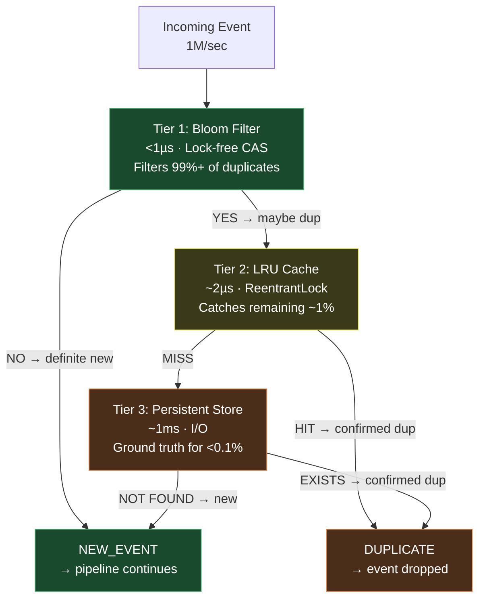
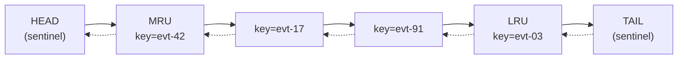

# TriggerFlow Deduplication Engine

**Three-Tier Probabilistic Pipeline: Bloom Filter, LRU Cache, and Persistent Store**

> This document describes the design, implementation, and probabilistic analysis of TriggerFlow's deduplication subsystem — the module responsible for filtering duplicate events at 1M+ events/sec with sub-microsecond latency on the fast path and bounded memory on all paths. Intended as a self-contained technical reference for staff-level engineers evaluating the dedup internals.

---

## Table of Contents

1. [Motivation and Architecture](#1-motivation-and-architecture)
2. [Bloom Filter (Tier 1)](#2-bloom-filter-tier-1)
   - 2.1 [MurmurHash3 Implementation](#21-murmurhash3-implementation)
   - 2.2 [Kirsch-Mitzenmacher Double Hashing](#22-kirsch-mitzenmacher-double-hashing)
   - 2.3 [Lock-Free Bit Manipulation](#23-lock-free-bit-manipulation)
   - 2.4 [Optimal Parameter Selection](#24-optimal-parameter-selection)
   - 2.5 [False Positive Analysis](#25-false-positive-analysis)
3. [LRU Event Cache (Tier 2)](#3-lru-event-cache-tier-2)
   - 3.1 [Data Structure](#31-data-structure)
   - 3.2 [Dual Expiry: LRU + TTL](#32-dual-expiry-lru--ttl)
   - 3.3 [Thread Safety](#33-thread-safety)
4. [Persistent Store (Tier 3)](#4-persistent-store-tier-3)
5. [Three-Tier Orchestration](#5-three-tier-orchestration)
   - 5.1 [Decision Flow](#51-decision-flow)
   - 5.2 [Recording Strategy](#52-recording-strategy)
   - 5.3 [Performance Model](#53-performance-model)
6. [Failure Modes and Mitigations](#6-failure-modes-and-mitigations)
7. [Design Decisions (ADR)](#7-design-decisions-adr)
8. [See Also](#8-see-also)

---

## 1. Motivation and Architecture

At 1M events/sec, exact deduplication faces a fundamental tension:

- **In-memory exact set** (`HashSet<EventKey>`): O(1) lookup but unbounded memory. At 100 bytes per key, 1M events/sec for 24 hours = 8.64 TB. Impractical.
- **Persistent exact set** (database lookup per event): Bounded memory but millisecond-level I/O per check. At 1ms per lookup, throughput drops to 1K events/sec. Unacceptable.

TriggerFlow resolves this with a three-tier pipeline where each tier handles a different slice of the event stream:



**Key insight:** The Bloom filter's false positive rate determines how many events reach Tier 2. At 0.1% FPR, only 1 in 1000 new events triggers a cache lookup. False positives never cause correctness issues — they only cause a redundant (but fast) cache check.

---

## 2. Bloom Filter (Tier 1)

### 2.1 MurmurHash3 Implementation

TriggerFlow implements 32-bit MurmurHash3 from scratch — the same hash function used by Guava, Apache Spark, and Redis HyperLogLog. The implementation follows Austin Appleby's reference specification.

**Algorithm outline:**

```java
public static int murmurhash3(byte[] data, int seed) {
    int h = seed;
    int len = data.length;

    // Process 4-byte blocks
    for (int i = 0; i + 4 <= len; i += 4) {
        int k = getIntLE(data, i);
        k *= 0xcc9e2d51;        // c1
        k = Integer.rotateLeft(k, 15);
        k *= 0x1b873593;        // c2
        h ^= k;
        h = Integer.rotateLeft(h, 13);
        h = h * 5 + 0xe6546b64;
    }

    // Process remaining 1-3 bytes (tail)
    int k = 0;
    switch (len & 3) {
        case 3: k ^= (data[len - 3] & 0xff) << 16;
        case 2: k ^= (data[len - 2] & 0xff) << 8;
        case 1: k ^= (data[len - 1] & 0xff);
                k *= 0xcc9e2d51;
                k = Integer.rotateLeft(k, 15);
                k *= 0x1b873593;
                h ^= k;
    }

    // Finalisation mix (fmix32) — avalanche
    h ^= len;
    h ^= h >>> 16;
    h *= 0x85ebca6b;
    h ^= h >>> 13;
    h *= 0xc2b2ae35;
    h ^= h >>> 16;

    return h;
}
```

**Why MurmurHash3 over SHA-256?** SHA-256 produces 256 bits of cryptographic-strength output at ~300 MB/sec. MurmurHash3 produces 32 bits of distribution-quality output at ~5 GB/sec — roughly 16× faster. Bloom filters need uniform distribution, not collision resistance. MurmurHash3's avalanche property (every input bit affects every output bit) is sufficient.

**Two-hash generation:** The Bloom filter needs k independent hash functions. Rather than computing k separate hashes, TriggerFlow invokes MurmurHash3 twice with different seeds (0 and 0x9747b28c) to produce two 32-bit values `h1` and `h2`. All k hash functions are derived from these two via the Kirsch-Mitzenmacher technique (see Section 2.2).

### 2.2 Kirsch-Mitzenmacher Double Hashing

Kirsch and Mitzenmacher (2006) proved that the k hash functions needed by a Bloom filter can be simulated using only two independent hash functions without increasing the false positive rate beyond the theoretical minimum. The formula:

```
h_i(x) = (h1(x) + i × h2(x)) mod m

Where:
  i  = hash function index (0 to k-1)
  h1 = MurmurHash3(key, seed=0)
  h2 = MurmurHash3(key, seed=0x9747b28c)
  m  = total bits in the Bloom filter
```

**Implementation:**

```java
public void add(byte[] key) {
    int h1 = murmurhash3(key, 0);
    int h2 = murmurhash3(key, 0x9747b28c);

    for (int i = 0; i < numHashFunctions; i++) {
        int combinedHash = h1 + i * h2;
        int bitIndex = (combinedHash & Integer.MAX_VALUE) % numBits;
        setBit(bitIndex);
    }
    count.incrementAndGet();
}

public boolean mightContain(byte[] key) {
    int h1 = murmurhash3(key, 0);
    int h2 = murmurhash3(key, 0x9747b28c);

    for (int i = 0; i < numHashFunctions; i++) {
        int combinedHash = h1 + i * h2;
        int bitIndex = (combinedHash & Integer.MAX_VALUE) % numBits;
        if (!getBit(bitIndex)) return false;  // definite negative
    }
    return true;  // probable positive
}
```

### 2.3 Lock-Free Bit Manipulation

The Bloom filter's bit array is implemented as an `AtomicLongArray`. Each `long` holds 64 bits. Setting and getting individual bits uses bitwise operations with CAS for thread safety.

```java
private final AtomicLongArray bits;

private void setBit(int index) {
    int wordIndex = index / 64;
    long mask = 1L << (index % 64);

    while (true) {
        long current = bits.get(wordIndex);
        long updated = current | mask;
        if (current == updated) return;  // already set
        if (bits.compareAndSet(wordIndex, current, updated)) return;  // CAS success
        // CAS failed — another thread modified; retry
    }
}

private boolean getBit(int index) {
    int wordIndex = index / 64;
    long mask = 1L << (index % 64);
    return (bits.get(wordIndex) & mask) != 0;
}
```

**Why CAS instead of locks?** A lock-based Bloom filter would serialize all concurrent `add()` calls — unacceptable at 1M events/sec. The CAS loop retries only when two threads simultaneously modify the same 64-bit word (1 in 64 chance of overlap at the bit level). In practice, CAS retries are extremely rare, making the operation effectively wait-free.

**Why `AtomicLongArray` over `BitSet`?** `java.util.BitSet` is not thread-safe. Wrapping it in a lock defeats the purpose. `AtomicLongArray` provides per-element atomic operations out of the box, and packing 64 bits per element minimizes array size.

### 2.4 Optimal Parameter Selection

The Bloom filter's false positive rate depends on three parameters: the number of expected insertions `n`, the bit array size `m`, and the number of hash functions `k`. TriggerFlow computes optimal values from the desired false positive rate `p`:

```
m = ⌈ -n × ln(p) / (ln 2)² ⌉        (optimal bit count)
k = ⌈ (m / n) × ln 2 ⌉              (optimal hash count)
```

**Default configuration:**

| Parameter | Value | Derivation |
|---|---|---|
| Expected insertions (n) | 1,000,000 | 24-hour dedup window at peak rate |
| Target FPR (p) | 0.001 (0.1%) | Balance between accuracy and memory |
| Bit array size (m) | 14,377,588 (~1.7 MB) | `-1M × ln(0.001) / (ln2)²` |
| Hash functions (k) | 10 | `(14.4M / 1M) × ln2` |

**Actual FPR formula:**

```
FPR = (1 - e^(-k×n/m))^k
    = (1 - e^(-10×1M/14.4M))^10
    ≈ 0.00098 (0.098%)
```

This is slightly below the 0.1% target — the ceiling functions in parameter computation provide a safety margin.

### 2.5 False Positive Analysis

A Bloom filter false positive occurs when all k bit positions for a non-member element happen to be set by other elements. The consequences in TriggerFlow:

| Scenario | Bloom Result | Cache Result | Final Result | Correctness |
|---|---|---|---|---|
| New event | NO | — | NEW_EVENT | Correct |
| New event (false positive) | YES | MISS | Check persistent → NEW_EVENT | Correct (extra cache check) |
| Duplicate event | YES | HIT | DUPLICATE_CACHED | Correct |
| Duplicate event (not in cache) | YES | MISS | Check persistent → DUPLICATE | Correct |

**Key property:** False positives never cause event loss. They only cause a redundant Tier 2 lookup — a ~2µs penalty on <0.1% of events. At 1M events/sec, 0.1% FPR means ~1000 extra cache lookups per second — negligible.

**False negatives are impossible.** If `add(key)` was called, `mightContain(key)` will always return `true`. This is a fundamental property of Bloom filters: bits are only set, never cleared.

---

## 3. LRU Event Cache (Tier 2)

### 3.1 Data Structure

The event cache uses the same algorithmic approach as StreamForge's CDN cache: an intrusive doubly-linked list with sentinel nodes, backed by a `ConcurrentHashMap<EventKey, Node>`.



| Operation | Steps | Time |
|---|---|---|
| `get(key)` | ConcurrentHashMap lookup → move to head | O(1) |
| `put(key, timestamp)` | Insert node → HashMap put → evict if full | O(1) |
| `contains(key)` | ConcurrentHashMap `containsKey()` | O(1) |
| `evictLRU()` | Remove `tail.prev` → HashMap remove | O(1) |
| `evictExpired()` | Iterate from tail, remove expired | O(expired count) |

### 3.2 Dual Expiry: LRU + TTL

The cache evicts entries through two independent mechanisms:

1. **LRU eviction**: When cache size exceeds capacity, the least-recently-used entry (`tail.prev`) is removed. This bounds memory to `capacity × entry_size`.
2. **TTL expiry**: Each entry carries an insertion timestamp. On access, if `now > insertedAt + ttl`, the entry is treated as expired and evicted. This ensures stale dedup records don't persist beyond the dedup window.

```java
class Node {
    EventKey key;
    Instant insertedAt;
    Node prev, next;

    boolean isExpired(Duration ttl) {
        return Instant.now().isAfter(insertedAt.plus(ttl));
    }
}
```

**Why both?** LRU alone doesn't expire old entries that are frequently accessed (a duplicate event that keeps arriving resets its LRU position). TTL alone doesn't bound memory (new unique events could fill memory before any TTL expires). The combination guarantees both bounded memory and bounded temporal window.

### 3.3 Thread Safety

The cache uses a `ReentrantLock` for list mutations and `ConcurrentHashMap` for key lookups:

- **`ConcurrentHashMap.get(key)`**: Lock-free read. Called by `mightContain()` for fast duplicate checks.
- **`ReentrantLock`**: Guards `moveToHead()`, `addAfterHead()`, and `evictLRU()` — all short operations (3–4 pointer assignments).

The lock critical section is deliberately narrow. A `get()` that finds a cache hit acquires the lock only for the `moveToHead()` operation — the HashMap lookup is outside the lock. This means cache misses (the common case when Bloom filter says "maybe") don't contend on the lock at all.

---

## 4. Persistent Store (Tier 3)

The `PersistentDedup` interface abstracts the durable deduplication store:

```java
public interface PersistentDedup {
    boolean exists(EventKey key);
    void record(EventKey key, Instant processedAt);
    int size();
}
```

**In-memory test double:** `InMemoryPersistentDedup` uses `ConcurrentHashMap<EventKey, Instant>` for unit testing.

**Production implementations** (swap via `TriggerFlowEngineBuilder`):

| Backend | Latency | Use Case |
|---|---|---|
| FlashCache (Redis-compatible) | <1ms | Sub-millisecond dedup with TTL expiry |
| PostgreSQL | 1–5ms | ACID-compliant dedup with full query support |
| DynamoDB | 1–10ms | Serverless, auto-scaling dedup |

The persistent store is called for <0.1% of events (those that pass the Bloom filter but miss the LRU cache). At 1M events/sec, this means ~1000 persistent lookups per second — well within the capacity of any database.

---

## 5. Three-Tier Orchestration

### 5.1 Decision Flow

The `DeduplicationFilter` orchestrates the three tiers:

```java
public enum DeduplicationResult {
    NEW_EVENT,
    DUPLICATE_CACHED,
    DUPLICATE_PERSISTENT
}

public DeduplicationResult check(EventKey key) {
    // Tier 1: Bloom filter (sub-microsecond)
    if (!bloomFilter.mightContain(key.toBytes())) {
        bloomFilter.add(key.toBytes());
        return NEW_EVENT;  // fast path — no further checks
    }

    // Tier 2: LRU cache (microseconds)
    if (eventCache.contains(key)) {
        metrics.duplicatesFiltered.incrementAndGet();
        return DUPLICATE_CACHED;
    }

    // Tier 3: Persistent store (milliseconds)
    if (persistentDedup.exists(key)) {
        eventCache.put(key, Instant.now());  // warm cache for next time
        metrics.duplicatesFiltered.incrementAndGet();
        return DUPLICATE_PERSISTENT;
    }

    bloomFilter.add(key.toBytes());
    return NEW_EVENT;
}
```

### 5.2 Recording Strategy

Events are recorded in the dedup stores **only after an action is triggered** — not on every event. This is a deliberate optimization:

```java
public void recordProcessed(EventKey key) {
    eventCache.put(key, Instant.now());
    persistentDedup.record(key, Instant.now());
}
```

**Why not record every event?** If an event passes all campaign checks but matches no rules, recording it in the persistent store wastes I/O. Only events that trigger actions need dedup protection against retry — because only those events have visible side effects.

### 5.3 Performance Model

For a workload of 1M events/sec with 30% duplicates:

| Tier | Events Reaching | Latency | Events Filtered | Purpose |
|---|---|---|---|---|
| Bloom (Tier 1) | 1,000,000 | <1µs | ~299,000 duplicates (99.7% of dups) | Fast probabilistic screen |
| Cache (Tier 2) | ~701,700 (700K new + 1.7K FP + ~300 dup) | ~2µs | ~300 remaining dups | Exact check, bounded memory |
| Persistent (Tier 3) | ~1,000 (FP that missed cache) | ~1ms | ~0 (rare) | Ground truth |

**Total dedup overhead per event:**
- 99.97% of events: <1µs (Bloom filter only)
- 0.02% of events: ~3µs (Bloom + cache)
- 0.01% of events: ~1ms (Bloom + cache + persistent)
- **Weighted average**: ~1.1µs per event

---

## 6. Failure Modes and Mitigations

| Failure | Impact | Mitigation |
|---|---|---|
| Bloom filter full (n >> expected) | FPR increases beyond 0.1% | Monitor `count` vs `expectedInsertions`; alert at 80% capacity |
| LRU cache thrashing (scan attack) | Hot entries evicted by burst of unique keys | Bloom filter pre-screens; only actual duplicates reach cache |
| Persistent store unavailable | Tier 3 lookups fail | Degrade to Tier 1+2 only; accept potential duplicate actions |
| CAS contention on Bloom | Retries increase latency | Extremely rare (1/64 chance of word-level conflict); bounded retries |
| Long-lived entries in cache | Memory pressure if TTL > cache capacity | Dual expiry ensures both LRU and TTL enforce bounds |
| Hash collision in MurmurHash3 | Two different keys produce same hash | Bloom FPR accounts for this; exact check in Tier 2/3 catches it |

---

## 7. Design Decisions (ADR)

| Decision | Context | Choice | Consequences | Reference |
|---|---|---|---|---|
| Three-tier over single-tier dedup | 1M/sec needs sub-µs fast path + bounded memory | Bloom → LRU → persistent | Complexity of three stores; optimal latency-memory trade-off | *DDIA* (Kleppmann), Ch. 11 |
| MurmurHash3 over SHA-256 | Bloom filter needs speed, not crypto strength | 32-bit MurmurHash3, two seeds | ~16× faster than SHA-256; sufficient distribution | Appleby, 2008 |
| Kirsch-Mitzenmacher over k independent hashes | Need k hash functions from 2 | `h_i = h1 + i*h2` | Proven equivalent FPR; 2 hash calls instead of k | Kirsch & Mitzenmacher, 2006 |
| AtomicLongArray over BitSet | Need thread-safe bit manipulation | CAS per 64-bit word | Lock-free adds; 64 bits per array element | *JCIP* (Goetz), Ch. 15 |
| Record-only after action triggered | Avoid wasting persistent I/O on no-op events | `recordProcessed()` called only on action | Reduces persistent writes by ~70% | Event sourcing pattern |
| Lazy TTL + bulk eviction | Balance reclamation vs overhead | Check on access; periodic `evictExpired()` | No memory leaks; amortized sweep cost | Redis TTL implementation |
| 0.1% FPR default | Balance memory (1.7 MB) vs accuracy | `-n*ln(p)/(ln2)²` → 14.4M bits | 10 hash functions; ~1000 extra cache lookups/sec at 1M events/sec | Bloom filter theory |

---

## 8. See Also

- [architecture.md](architecture.md) — System-wide component map and design philosophy
- [rule-engine.md](rule-engine.md) — Rule evaluation after dedup (pipeline Step 4)
- [campaign-and-actions.md](campaign-and-actions.md) — Campaign matching and action dispatch (pipeline Steps 3–5)
- [architecture-tradeoffs.md](architecture-tradeoffs.md) — Full trade-off analysis including dedup design choices

---

*Last updated: 2026-04-03. Maintained by the TriggerFlow core team.*
