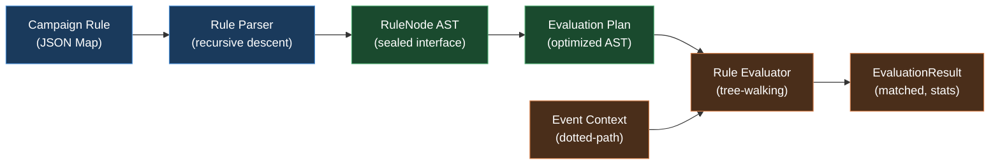
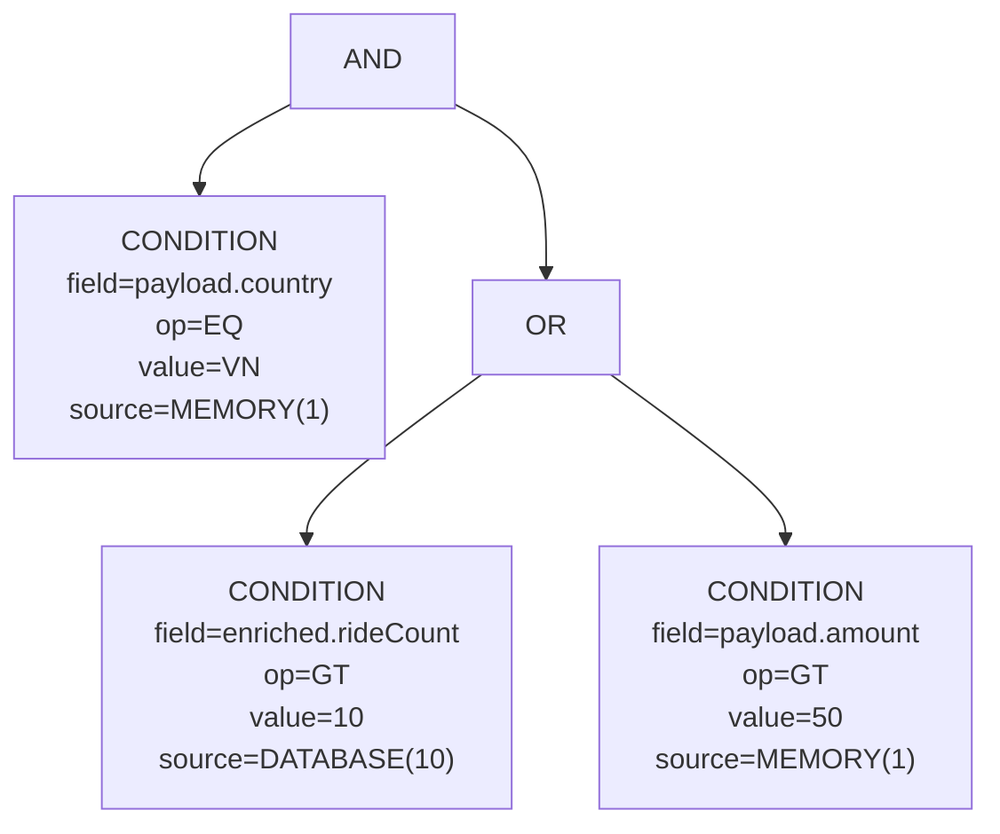

# TriggerFlow Rule Engine

**Sealed AST, Recursive Descent Parsing, and Weighted Short-Circuit Evaluation**

> This document describes the design, implementation, and optimization strategy of TriggerFlow's rule evaluation engine — the module responsible for matching events against campaign conditions with cost-aware short-circuit evaluation. Intended as a self-contained technical reference for staff-level engineers evaluating the rule engine internals.

---

## Table of Contents

1. [Overview](#1-overview)
2. [RuleNode AST (Sealed Types)](#2-rulenode-ast-sealed-types)
   - 2.1 [Node Types](#21-node-types)
   - 2.2 [Weight Model](#22-weight-model)
3. [Rule Parser (Recursive Descent)](#3-rule-parser-recursive-descent)
   - 3.1 [Input Format](#31-input-format)
   - 3.2 [Parsing Algorithm](#32-parsing-algorithm)
   - 3.3 [Error Reporting](#33-error-reporting)
4. [Rule Evaluator (Tree-Walking Interpreter)](#4-rule-evaluator-tree-walking-interpreter)
   - 4.1 [Evaluation Algorithm](#41-evaluation-algorithm)
   - 4.2 [Weighted Short-Circuit Optimization](#42-weighted-short-circuit-optimization)
   - 4.3 [Evaluation Plan (Pre-Compiled)](#43-evaluation-plan-pre-compiled)
5. [Event Context and Field Resolution](#5-event-context-and-field-resolution)
   - 5.1 [Dotted-Path Resolution](#51-dotted-path-resolution)
   - 5.2 [Data Sources and Weights](#52-data-sources-and-weights)
6. [Comparison Operators](#6-comparison-operators)
7. [Performance Analysis](#7-performance-analysis)
8. [Design Decisions (ADR)](#8-design-decisions-adr)
9. [See Also](#9-see-also)

---

## 1. Overview

The rule engine sits at Step 4 of TriggerFlow's five-step event pipeline — after deduplication and campaign prefiltering, before action dispatch. Its job is to evaluate a campaign's boolean condition tree against an event's payload and enrichment data, and return a match/no-match result with evaluation statistics.

The engine is built on three components:

1. **RuleNode** — a sealed AST (Abstract Syntax Tree) with four node types representing boolean conditions.
2. **RuleParser** — a recursive descent parser that transforms JSON-derived `Map<String, Object>` into a `RuleNode` tree.
3. **RuleEvaluator** — a tree-walking interpreter that evaluates the AST with weighted short-circuit optimization.



---

## 2. RuleNode AST (Sealed Types)

### 2.1 Node Types

The `RuleNode` sealed interface defines four implementations. The Java compiler enforces exhaustive handling in switch expressions — adding a fifth node type forces every evaluator to handle it.

```java
public sealed interface RuleNode {

    record AndNode(List<RuleNode> children) implements RuleNode {
        public AndNode {
            children = List.copyOf(children);  // defensive copy
        }
    }

    record OrNode(List<RuleNode> children) implements RuleNode {
        public OrNode {
            children = List.copyOf(children);
        }
    }

    record NotNode(RuleNode child) implements RuleNode {
        public NotNode {
            Objects.requireNonNull(child);
        }
    }

    record ConditionNode(
        String field,
        ComparisonOp op,
        Object value,
        DataSource source
    ) implements RuleNode {
        public ConditionNode {
            Objects.requireNonNull(field);
            Objects.requireNonNull(op);
            Objects.requireNonNull(source);
        }
    }

    int maxWeight();  // cost model for short-circuit ordering
}
```

**Example AST** for the rule "user is in Vietnam AND (ride count > 10 OR payment amount > 50)":



### 2.2 Weight Model

Every `RuleNode` computes a `maxWeight()` — the maximum cost of evaluating that subtree. The weight model drives short-circuit ordering: cheaper subtrees are evaluated first.

```java
// ConditionNode: weight = data source cost
maxWeight() → source.weight()
// MEMORY=1, DATABASE=10, EXTERNAL_SERVICE=100

// AndNode: weight = max of children (worst case: all evaluated)
maxWeight() → children.stream().mapToInt(RuleNode::maxWeight).max()

// OrNode: weight = max of children (worst case: all evaluated)
maxWeight() → children.stream().mapToInt(RuleNode::maxWeight).max()

// NotNode: weight = child weight
maxWeight() → child.maxWeight()
```

**Why max, not sum?** The weight represents the worst-case cost of a single evaluation path, not the total cost. Short-circuit optimization means most children are never evaluated. Using `max` correctly models the "most expensive child we might have to evaluate" scenario that drives ordering decisions.

---

## 3. Rule Parser (Recursive Descent)

### 3.1 Input Format

Rules are defined as JSON-compatible `Map<String, Object>` structures:

```json
{
    "type": "AND",
    "children": [
        {
            "type": "CONDITION",
            "field": "payload.country",
            "op": "EQ",
            "value": "VN",
            "source": "MEMORY"
        },
        {
            "type": "OR",
            "children": [
                {
                    "type": "CONDITION",
                    "field": "enriched.rideCount",
                    "op": "GT",
                    "value": 10,
                    "source": "DATABASE"
                },
                {
                    "type": "CONDITION",
                    "field": "payload.amount",
                    "op": "GT",
                    "value": 50,
                    "source": "MEMORY"
                }
            ]
        }
    ]
}
```

### 3.2 Parsing Algorithm

The parser uses recursive descent — each node type has a corresponding parsing method:

```java
public class RuleParser {

    public RuleNode parse(Map<String, Object> json) {
        String type = requireString(json, "type");
        return switch (type) {
            case "AND"       -> parseAnd(json);
            case "OR"        -> parseOr(json);
            case "NOT"       -> parseNot(json);
            case "CONDITION" -> parseCondition(json);
            default -> throw new RuleParseException("Unknown type: " + type);
        };
    }

    private RuleNode parseAnd(Map<String, Object> json) {
        List<Map<String, Object>> children = requireList(json, "children");
        return new AndNode(children.stream().map(this::parse).toList());
    }

    private RuleNode parseCondition(Map<String, Object> json) {
        return new ConditionNode(
            requireString(json, "field"),
            ComparisonOp.valueOf(requireString(json, "op")),
            json.get("value"),
            DataSource.valueOf(requireString(json, "source"))
        );
    }
}
```

### 3.3 Error Reporting

The parser throws `RuleParseException` with contextual information:

- Missing required field: `"Missing required field 'type' in rule node"`
- Unknown type: `"Unknown rule type: XAND"`
- Invalid operator: `"Unknown comparison operator: LIKE"`
- Type mismatch: `"Expected List for 'children', got String"`

Error messages include the field name and expected type, enabling campaign authors to diagnose rule definition errors without debugging the parser.

---

## 4. Rule Evaluator (Tree-Walking Interpreter)

### 4.1 Evaluation Algorithm

The `RuleEvaluator` walks the AST recursively, evaluating each node against the `EventContext`:

```java
public EvaluationResult evaluate(RuleNode node, EventContext ctx) {
    return switch (node) {
        case AndNode and   -> evaluateAnd(and, ctx);
        case OrNode or     -> evaluateOr(or, ctx);
        case NotNode not   -> evaluateNot(not, ctx);
        case ConditionNode cond -> evaluateCondition(cond, ctx);
    };
}
```

**Result tracking:**

```java
public record EvaluationResult(
    boolean matched,
    int conditionsEvaluated,
    int conditionsSkipped,
    Duration elapsed
) {}
```

### 4.2 Weighted Short-Circuit Optimization

The key optimization: before evaluating an AND or OR node's children, **sort them by `maxWeight()` ascending** so cheap conditions are checked first.

**AND evaluation with short-circuit:**

```java
private EvaluationResult evaluateAnd(AndNode node, EventContext ctx) {
    List<RuleNode> sorted = node.children().stream()
        .sorted(comparing(RuleNode::maxWeight))
        .toList();

    int evaluated = 0;
    int skipped = 0;

    for (RuleNode child : sorted) {
        EvaluationResult childResult = evaluate(child, ctx);
        evaluated += childResult.conditionsEvaluated();

        if (!childResult.matched()) {
            // Short-circuit: remaining children are skipped
            skipped += remainingConditionCount(sorted, evaluated);
            return new EvaluationResult(false, evaluated, skipped, elapsed);
        }
    }
    return new EvaluationResult(true, evaluated, skipped, elapsed);
}
```

**OR evaluation with short-circuit:**

```java
private EvaluationResult evaluateOr(OrNode node, EventContext ctx) {
    List<RuleNode> sorted = node.children().stream()
        .sorted(comparing(RuleNode::maxWeight))
        .toList();

    for (RuleNode child : sorted) {
        EvaluationResult childResult = evaluate(child, ctx);
        if (childResult.matched()) {
            // Short-circuit: remaining children are skipped
            return new EvaluationResult(true, evaluated, skipped, elapsed);
        }
    }
    return new EvaluationResult(false, evaluated, skipped, elapsed);
}
```

**Example — weighted short-circuit in action:**

```
Rule: AND(
    payload.country EQ "VN"           [MEMORY, weight=1]
    enriched.rideCount GT 10          [DATABASE, weight=10]
    external.creditScore GT 700       [EXTERNAL_SERVICE, weight=100]
)

Scenario 1: country = "US"
  → Evaluate MEMORY condition first (weight=1): false
  → Short-circuit: skip DATABASE and EXTERNAL_SERVICE conditions
  → Saved: 1 DB query + 1 external API call

Scenario 2: country = "VN", rideCount = 5
  → Evaluate MEMORY condition (weight=1): true
  → Evaluate DATABASE condition (weight=10): false
  → Short-circuit: skip EXTERNAL_SERVICE condition
  → Saved: 1 external API call

Scenario 3: country = "VN", rideCount = 15, creditScore = 800
  → Evaluate all three: true AND true AND true
  → No short-circuit (all conditions needed)
```

### 4.3 Evaluation Plan (Pre-Compiled)

For campaigns that are evaluated millions of times, the `EvaluationPlan` pre-compiles the weight-sorted AST once and reuses it:

```java
public class EvaluationPlan {

    public RuleNode optimize(RuleNode node) {
        return switch (node) {
            case AndNode and -> new AndNode(
                and.children().stream()
                    .map(this::optimize)        // recursively optimize subtrees
                    .sorted(comparing(RuleNode::maxWeight))  // sort by weight
                    .toList()
            );
            case OrNode or -> new OrNode(
                or.children().stream()
                    .map(this::optimize)
                    .sorted(comparing(RuleNode::maxWeight))
                    .toList()
            );
            case NotNode not -> new NotNode(optimize(not.child()));
            case ConditionNode cond -> cond;  // leaf: nothing to optimize
        };
    }
}
```

**Why pre-compile?** Sorting children on every evaluation is O(c log c) where c = number of children. For a campaign evaluated 1M times/sec with 5 children, that's 1M × 5 × log₂(5) ≈ 11.6M comparisons/sec wasted. Pre-compiling reduces this to zero — the optimized AST is immutable and reused across all evaluations.

---

## 5. Event Context and Field Resolution

### 5.1 Dotted-Path Resolution

The `EventContext` resolves dotted field paths against three data sources:

```java
public record EventContext(
    TriggerFlowEvent event,
    Map<String, Object> enrichedData
) {
    public Object resolve(String fieldPath) {
        String[] segments = fieldPath.split("\\.");

        if (segments[0].equals("event")) {
            return resolveEventField(segments[1]);
        }
        if (segments[0].equals("payload")) {
            return resolveNested(event.payload(), segments, 1);
        }
        if (segments[0].equals("enriched")) {
            return resolveNested(enrichedData, segments, 1);
        }

        // Single segment: try payload first, then enriched
        Object result = event.payload().get(fieldPath);
        return (result != null) ? result : enrichedData.get(fieldPath);
    }
}
```

**Resolution examples:**

| Path | Resolves To |
|---|---|
| `event.userId` | `event.userId()` |
| `event.eventType` | `event.eventType()` |
| `payload.country` | `event.payload().get("country")` |
| `payload.order.total` | `event.payload().get("order")` → `.get("total")` |
| `enriched.tier` | `enrichedData.get("tier")` |
| `country` (single segment) | `payload.get("country")` fallback to `enrichedData.get("country")` |

### 5.2 Data Sources and Weights

The `DataSource` enum models the cost of accessing different data tiers:

```java
public enum DataSource {
    MEMORY(1),            // payload fields, enriched data already in memory
    DATABASE(10),         // requires a database query (e.g., user profile lookup)
    EXTERNAL_SERVICE(100); // requires an external API call (e.g., credit score check)

    private final int weight;
}
```

**Why these specific weights?** The weights are relative, not absolute. The 1:10:100 ratio reflects the typical latency difference: memory access (~1µs), database query (~10µs for cached, ~1ms for cold), external API call (~100ms). The exact values don't matter for short-circuit correctness — only the ordering matters. A 1:2:3 ratio would produce the same evaluation order. The 1:10:100 ratio was chosen for readability and to leave room for intermediate tiers (e.g., `CACHE(5)` for Redis lookups).

---

## 6. Comparison Operators

The `ComparisonOp` enum defines eight operators with overloaded evaluation for different types:

| Operator | Numeric | String | Object |
|---|---|---|---|
| `EQ` | `a == b` | case-insensitive `equalsIgnoreCase()` | `equals()` |
| `NEQ` | `a != b` | case-insensitive `!equalsIgnoreCase()` | `!equals()` |
| `GT` | `a > b` | — | Number dispatch |
| `GTE` | `a >= b` | — | Number dispatch |
| `LT` | `a < b` | — | Number dispatch |
| `LTE` | `a <= b` | — | Number dispatch |
| `IN` | — | comma-separated list contains value | — |
| `CONTAINS` | — | `string.contains(substring)` | — |

**Type coercion:** When comparing a `Number` against a `String`, the operator attempts to parse the string as a `Double`. If parsing fails, the comparison returns `false` (fail-safe).

```java
public boolean evaluate(Object actual, Object expected) {
    if (actual instanceof Number a && expected instanceof Number e) {
        return evaluateNumeric(a.doubleValue(), e.doubleValue());
    }
    if (actual instanceof String a && expected instanceof String e) {
        return evaluateString(a, e);
    }
    // Mixed types: try Number dispatch
    if (actual instanceof Number && expected instanceof String) {
        try {
            return evaluateNumeric(
                ((Number) actual).doubleValue(),
                Double.parseDouble((String) expected)
            );
        } catch (NumberFormatException e) {
            return false;
        }
    }
    return this == EQ ? Objects.equals(actual, expected) : false;
}
```

---

## 7. Performance Analysis

### Evaluation Latency by Rule Complexity

| Rule Shape | Conditions | Best Case (short-circuit) | Worst Case (all evaluated) |
|---|---|---|---|
| Single condition (MEMORY) | 1 | ~1µs | ~1µs |
| AND with 3 MEMORY conditions | 3 | ~1µs (first false) | ~3µs |
| AND with MEMORY + DATABASE + EXTERNAL | 3 | ~1µs (MEMORY false) | ~100ms (all evaluated) |
| OR with 5 MEMORY conditions | 5 | ~1µs (first true) | ~5µs |
| Nested AND(OR(...), OR(...)) | 10 | ~1µs | ~10µs (all MEMORY) |

### Short-Circuit Effectiveness

For a typical campaign with 5 conditions (3 MEMORY, 1 DATABASE, 1 EXTERNAL_SERVICE):

| Event Match Rate | Avg Conditions Evaluated | Avg Conditions Skipped | Avg Latency |
|---|---|---|---|
| 5% match (typical) | 1.3 | 3.7 | ~2µs |
| 50% match | 2.8 | 2.2 | ~15µs |
| 95% match | 4.7 | 0.3 | ~90µs |

At 5% match rate (typical for marketing campaigns), weighted short-circuit reduces average evaluation cost by 74% compared to unoptimized evaluation.

---

## 8. Design Decisions (ADR)

| Decision | Context | Choice | Consequences | Reference |
|---|---|---|---|---|
| Sealed interface for RuleNode | Finite set of rule types; must prevent illegal states | 4 sealed record variants | Compiler-enforced exhaustive matching; can't add types without recompilation | *Effective Java* (Bloch), Item 17 |
| Recursive descent parser | Rules are JSON-derived maps, not strings | Top-down dispatch on "type" field | Simple, debuggable; no parser generator needed | *Compilers* (Aho et al.), Ch. 4 |
| Weight-based short-circuit | EXTERNAL_SERVICE conditions are 100× costlier than MEMORY | Sort children by ascending `maxWeight()` | 74% cost reduction at 5% match rate; sort overhead amortized via EvaluationPlan | Query optimizer principle |
| Pre-compiled EvaluationPlan | Same rule evaluated millions of times | Sort once, reuse immutable AST | Zero per-evaluation sort overhead; extra memory for sorted copy | Prepared statement analogy |
| Dotted-path resolution | Events have nested payloads with varying structure | Split on ".", resolve against payload/event/enriched | Supports arbitrary nesting depth; no schema validation | JSONPath subset |
| 1:10:100 weight ratio | Must model latency difference across tiers | Relative weights, not absolute latencies | Clear ordering; room for intermediate tiers | Cost-based query optimization |
| Fail-safe type coercion | Mixed types in condition values | Return false on type mismatch | Never throws on bad data; may silently skip valid conditions | Defensive programming |

---

## 9. See Also

- [architecture.md](architecture.md) — System-wide component map and pipeline overview
- [deduplication.md](deduplication.md) — Dedup (pipeline Step 2) that runs before rule evaluation
- [campaign-and-actions.md](campaign-and-actions.md) — Campaign matching and action dispatch around rule evaluation
- [architecture-tradeoffs.md](architecture-tradeoffs.md) — Full trade-off analysis including rule engine design choices

---

*Last updated: 2026-04-03. Maintained by the TriggerFlow core team.*
