# TriggerFlow System Design

**Real-Time Event-Driven Marketing Automation Engine**

> A seven-step system design walkthrough following the approach from *Hacking the System Design Interview* by Stanley Chiang. This document covers TriggerFlow end-to-end: from problem clarification through data models, capacity estimates, high-level architecture, deep-dive component design, API definitions, and scaling bottleneck analysis.

---

## Table of Contents

1. [Step 1: Clarify the Problem and Scope](#step-1-clarify-the-problem-and-scope)
2. [Step 2: Define the Data Models](#step-2-define-the-data-models)
3. [Step 3: Back-of-the-Envelope Estimates](#step-3-back-of-the-envelope-estimates)
4. [Step 4: High-Level System Design](#step-4-high-level-system-design)
5. [Step 5: Design Components in Detail](#step-5-design-components-in-detail)
6. [Step 6: Service Definitions, APIs, Interfaces](#step-6-service-definitions-apis-interfaces)
7. [Step 7: Scaling Problems and Bottlenecks](#step-7-scaling-problems-and-bottlenecks)

---

## Step 1: Clarify the Problem and Scope

### Problem Statement

> "Design a real-time event processing and campaign automation system capable of ingesting millions of user behavioral events per second, deduplicating them, evaluating rule-based campaign conditions, and dispatching marketing actions (emails, push notifications, in-app messages) with guaranteed delivery, A/B testing, and budget enforcement."

### Use Cases

| # | Use Case | Actor | Description |
|---|----------|-------|-------------|
| UC-1 | Event ingestion | Application backend | Ingest user behavioral events (clicks, purchases, signups, ride completions) from upstream microservices via a partitioned event stream |
| UC-2 | Duplicate filtering | System | Detect and drop duplicate events at scale without unbounded memory or I/O |
| UC-3 | Rule evaluation | System | Evaluate boolean campaign conditions (rule trees) against event payloads and enrichment data |
| UC-4 | Campaign lifecycle | Marketing operator | Create, activate, pause, complete, and cancel campaigns with validated state transitions |
| UC-5 | A/B testing | Marketing operator | Route users to experiment variants deterministically for consistent experience |
| UC-6 | Budget enforcement | System | Track per-campaign spend and halt campaigns when budgets are exhausted |
| UC-7 | User rate limiting | System | Enforce per-user action limits per campaign within configurable time windows |
| UC-8 | Action dispatch | System | Trigger marketing actions with rate limiting, delayed scheduling, and retry on failure |

### Functional Requirements

| ID | Requirement | Priority |
|----|-------------|----------|
| FR-1 | Ingest events from a partitioned stream with configurable parallelism | P0 |
| FR-2 | Three-tier deduplication: probabilistic pre-screen, in-memory exact cache, persistent ground truth | P0 |
| FR-3 | Parse campaign rules from JSON into a type-safe AST and evaluate with short-circuit optimization | P0 |
| FR-4 | Enforce campaign state machine transitions (DRAFT, ACTIVE, PAUSED, COMPLETED, CANCELLED) | P0 |
| FR-5 | Deterministic A/B test routing via hash buckets (same user always gets same variant) | P1 |
| FR-6 | CAS-loop budget tracking with high-limit optimization | P0 |
| FR-7 | Per-user action limiting with nested concurrent maps and CAS | P1 |
| FR-8 | Rate-limited action dispatch with lazy-refill token bucket per downstream service | P0 |
| FR-9 | Delayed action scheduling via hierarchical timing wheel (O(1) insert) | P1 |
| FR-10 | Retry failed actions with exponential backoff and jitter | P0 |

### Non-Functional Requirements

| ID | Requirement | Target |
|----|-------------|--------|
| NFR-1 | Throughput | 1M+ events/sec on a single instance |
| NFR-2 | End-to-end latency | <1ms p99 (Bloom through action dispatch) |
| NFR-3 | Bloom filter check latency | <1 microsecond |
| NFR-4 | LRU cache hit latency | ~2 microseconds |
| NFR-5 | Rule evaluation latency | ~10 microseconds (all-MEMORY conditions) |
| NFR-6 | Timing wheel insert latency | <1 microsecond |
| NFR-7 | Event processing semantics | Exactly-once via three-tier dedup |
| NFR-8 | External dependencies | Zero (except SLF4J for logging) |
| NFR-9 | Java version | 21 (sealed interfaces, records, virtual threads) |
| NFR-10 | Memory footprint | <100MB hot data for 1M events/sec workload |

### Clarifying Questions and Answers

| # | Question | Answer |
|---|----------|--------|
| Q1 | What ordering guarantees do we need for events? | Per-partition ordering. Events within the same partition are processed sequentially by a single virtual thread. Cross-partition ordering is not guaranteed. |
| Q2 | How complex can campaign rules be? | Boolean condition trees with AND, OR, NOT operators and leaf conditions with 8 comparison operators (EQ, NEQ, GT, GTE, LT, LTE, IN, CONTAINS). No ML-based scoring in the hot path. |
| Q3 | What action delivery guarantees do we provide? | At-least-once delivery with dedup. Actions are dispatched with retry (3 attempts, exponential backoff + jitter). The dedup layer prevents duplicate action triggers from duplicate events. |
| Q4 | What precision is required for budget tracking? | Exact precision when the remaining budget drops below 100K units. Above 100K, eventual consistency is acceptable (the high-limit optimization uses unconditional atomic decrement instead of CAS). |
| Q5 | How many concurrent campaigns do we support? | 1,000+ active campaigns. The EventPrefilter provides O(1) campaign lookup by event type, so total campaign count does not affect per-event latency. |
| Q6 | What happens when a downstream service is unavailable? | Actions are retried with exponential backoff (100ms, 200ms, 400ms). After 3 failed attempts, the action is marked FAILED and the `actionsFailed` metric is incremented for alerting. |

---

## Step 2: Define the Data Models

### 2.1 Core Entities

#### TriggerFlowEvent (Immutable Record)

The fundamental unit of data flowing through the pipeline. Every event is an immutable Java record with six fields.

| Field | Type | Size (bytes) | Description |
|-------|------|-------------|-------------|
| `eventId` | `String` | ~64 | Globally unique event identifier (UUID) |
| `eventType` | `String` | ~32 | Category of the event (e.g., RIDE_COMPLETED, PAYMENT_SUCCEEDED) |
| `userId` | `String` | ~64 | User who triggered the event |
| `timestamp` | `long` | 8 | Epoch milliseconds when the event occurred |
| `properties` | `Map<String, Object>` | ~512 avg | Event payload (country, amount, product, etc.) |
| `source` | `String` | ~32 | Originating service name |
| **Total** | | **~712** | **Average serialized size per event** |

```java
public record TriggerFlowEvent(
    String eventId,
    String eventType,
    String userId,
    long timestamp,
    Map<String, Object> properties,
    String source
) {
    public TriggerFlowEvent {
        properties = Map.copyOf(properties);  // defensive copy, immutable
    }
}
```

#### Campaign (Immutable Record)

A campaign is the central configuration entity that binds a trigger event type to a set of conditions and actions.

| Field | Type | Size (bytes) | Description |
|-------|------|-------------|-------------|
| `campaignId` | `String` | ~64 | Unique campaign identifier |
| `name` | `String` | ~128 | Human-readable campaign name |
| `status` | `CampaignStatus` | 1 | Current lifecycle state (enum) |
| `triggerEventType` | `EventType` | ~32 | Event type that triggers evaluation |
| `conditions` | `RuleNode` (AST) | ~2,048 | Serialized rule tree |
| `actions` | `List<ActionDefinition>` | ~1,024 | Actions to execute on match |
| `budget` | `BudgetConstraint` | 16 | Max spend + currency |
| `abTest` | `ABTestConfig` | ~128 | Variant proportions map |
| `actionDelay` | `Duration` | 8 | Delay before action dispatch |
| `userLimit` | `UserLimitation` | 16 | Per-user rate limit config |
| `startTime` | `Instant` | 8 | Campaign start timestamp |
| `endTime` | `Instant` | 8 | Campaign end timestamp |
| **Total** | | **~3,481** | **Average serialized size per campaign** |

#### RuleNode (Sealed AST)

The rule tree is modeled as a sealed interface with four implementations. The Java compiler enforces exhaustive pattern matching.

| Node Type | Fields | Description |
|-----------|--------|-------------|
| `AndNode` | `List<RuleNode> children` | All children must match (short-circuits on first `false`) |
| `OrNode` | `List<RuleNode> children` | Any child must match (short-circuits on first `true`) |
| `NotNode` | `RuleNode child` | Inverts the child's match result |
| `ConditionNode` | `field`, `op`, `value`, `source` | Leaf: compares an event field against a value |

#### ActionResult

| Field | Type | Size (bytes) | Description |
|-------|------|-------------|-------------|
| `actionId` | `String` | ~64 | Unique action execution identifier |
| `campaignId` | `String` | ~64 | Owning campaign |
| `userId` | `String` | ~64 | Target user |
| `status` | `ActionStatus` | 1 | PENDING, SENT, FAILED, or RETRYING |
| `attempts` | `int` | 4 | Number of delivery attempts |
| `nextRetry` | `long` | 8 | Epoch ms of next retry (0 if not retrying) |
| `createdAt` | `long` | 8 | Epoch ms when action was created |
| **Total** | | **~213** | **Average serialized size** |

#### BloomFilter Parameters

| Parameter | Value | Description |
|-----------|-------|-------------|
| `bitArray` | `AtomicLongArray` (~1.7 MB for 1M elements at 0.1% FPR) | Lock-free CAS-backed bit storage |
| `numHashes` | `int` (10) | Optimal hash function count |
| `numBits` | `long` (14.4M) | Total bits in the filter |
| `expectedInsertions` | `long` (1M) | Capacity before FPR degrades |
| `count` | `AtomicLong` | Current insertion count for monitoring |

### 2.2 Entity Relationship Diagram

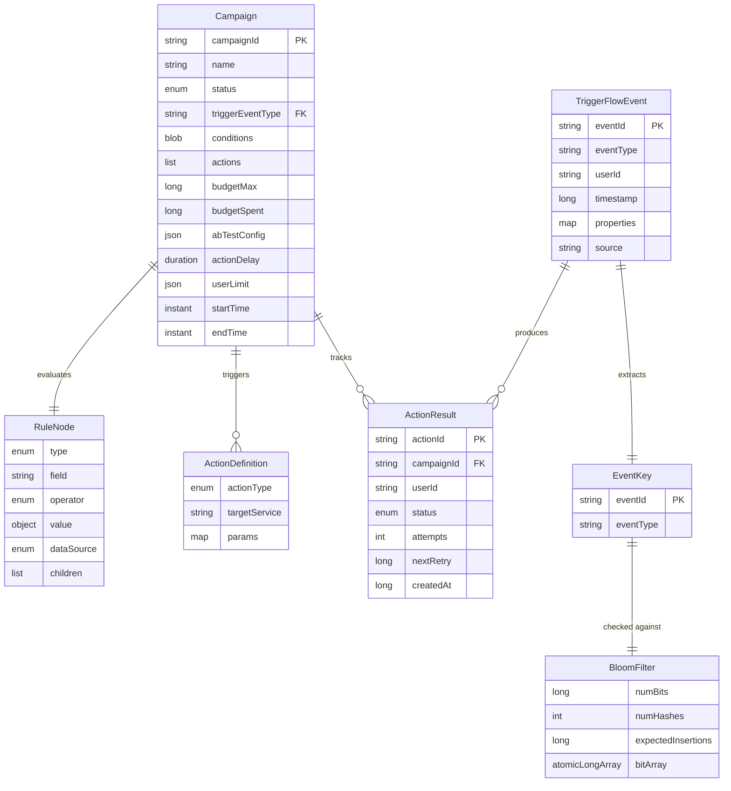

### 2.3 State Diagram: Campaign Lifecycle

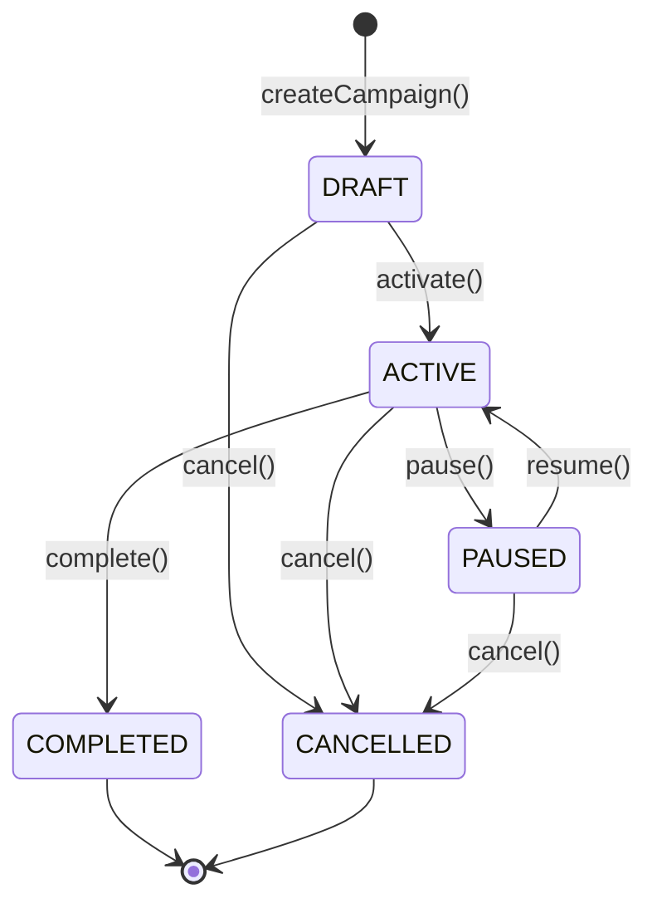

---

## Step 3: Back-of-the-Envelope Estimates

### Scenario: Large E-Commerce / Ride-Hailing Marketing Platform

#### Traffic Estimates

| Metric | Value | Derivation |
|--------|-------|------------|
| Monthly Active Users (MAU) | 50M | Platform scale assumption |
| Daily Active Users (DAU) | 10M | 20% of MAU |
| Events per user per day | 10 | Clicks, purchases, signups, ride completions |
| Daily event volume | 100M | 10M DAU x 10 events |
| Average events/sec | ~1,157 | 100M / 86,400 |
| Peak events/sec (10x) | ~11,570 | Burst during flash sales, rush hour |
| Design capacity | 1M events/sec | 100x headroom for growth and burst absorption |

#### Deduplication Estimates

| Metric | Value | Derivation |
|--------|-------|------------|
| Source duplicate rate | ~1% | Network retries, at-least-once delivery |
| Bloom filter capacity | 10M events | Rolling window (configurable, default 24h) |
| Bloom filter FPR | 0.1% (0.001) | Tunable; balances memory vs accuracy |
| Bloom filter memory | 14.4M bits = **1.7 MB** | `-n * ln(p) / (ln2)^2` = `-10M * ln(0.001) / 0.4805` |
| Bloom filter hash functions | 10 | `(m/n) * ln2` = `(14.4M / 10M) * 0.693` |
| Events reaching Tier 2 (cache) | ~0.1% of new events | Bloom false positives |
| Events reaching Tier 3 (persistent) | ~0.01% | Cache misses from Bloom FPs |
| Extra cache lookups/sec at 1M events/sec | ~1,000 | 0.1% FPR x 1M |

#### Rule Engine Estimates

| Metric | Value | Derivation |
|--------|-------|------------|
| Active campaigns | 1,000 | Typical for large platform |
| Campaigns per event type | ~5 | After EventPrefilter O(1) lookup |
| Rule evaluations per event | ~5 | 1 event x 5 matching campaigns |
| Rule eval latency (MEMORY only) | ~10 microseconds | Benchmark from sealed AST tree-walk |
| Total rule eval CPU per second | 5M evals/sec x 10 microseconds = **50 CPU-seconds/sec** | Manageable with virtual threads |
| Short-circuit savings (5% match rate) | 74% fewer conditions evaluated | Weighted cost optimization |

#### Storage Estimates

| Data Type | Daily Volume | Monthly Volume | Derivation |
|-----------|-------------|----------------|------------|
| Raw events | ~71 GB/day | ~2.1 TB/month | 100M events/day x 712 bytes |
| Action results | ~213 MB/day | ~6.4 GB/month | 1% trigger rate = 1M actions/day x 213 bytes |
| Campaign configs | ~3.4 MB total | ~3.4 MB total | 1K campaigns x 3,481 bytes (in-memory only) |
| Bloom filter state | 1.7 MB | 1.7 MB | Single filter instance |
| LRU cache | ~71 MB | ~71 MB | 100K entries x 712 bytes |

#### Memory Budget (Hot Data)

| Component | Memory | Notes |
|-----------|--------|-------|
| Bloom filter | 1.7 MB | AtomicLongArray for 14.4M bits |
| LRU event cache | 71 MB | 100K entries x ~712 bytes avg |
| Campaign registry | 3.4 MB | 1K campaigns x 3,481 bytes |
| Event prefilter index | ~0.5 MB | Volatile Map<EventType, List<Campaign>> |
| Timing wheel slots | ~10 MB | 512 slots x ArrayList overhead |
| Budget tracker | ~0.1 MB | 1K AtomicLong entries |
| User limit tracker | ~8 MB | Nested ConcurrentHashMaps for active users |
| Metrics counters | <1 KB | 7 AtomicLong values |
| **Total hot data** | **~96 MB** | **Well within single-JVM capacity** |

#### Bandwidth Estimates

| Direction | Throughput | Derivation |
|-----------|-----------|------------|
| Event ingestion | ~712 MB/sec | 1M events/sec x 712 bytes |
| Action dispatch (outbound) | ~2.1 MB/sec | 10K actions/sec x 213 bytes |
| Persistent dedup I/O | ~0.7 MB/sec | ~1K lookups/sec x 712 bytes |

---

## Step 4: High-Level System Design

### 4.1 Unscaled Design (Why It Fails)

The simplest possible architecture is a single server that reads events, checks rules, and dispatches actions.


**Why this fails at scale:**

| Problem | Impact |
|---------|--------|
| No parallelism | Single thread processes events sequentially; throughput capped at ~10K events/sec |
| No deduplication | Duplicate events trigger duplicate actions (double emails, double charges) |
| No backpressure | Event source overwhelms the server during traffic spikes |
| Single point of failure | Server crash loses all in-flight events and pending actions |
| No rate limiting | Burst of matched events hammers downstream services simultaneously |

### 4.2 Scaled Design

The production architecture partitions the event stream, deduplicates at three tiers, prefilters campaigns, evaluates rules with short-circuit optimization, and dispatches actions through a rate-limited timing wheel.

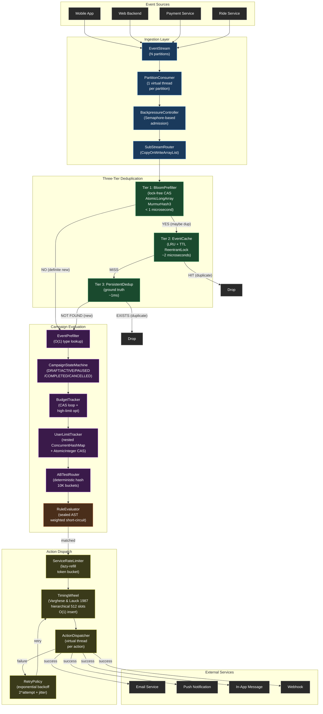

### 4.3 Five-Step Event Pipeline

Every event flows through exactly five steps inside the `EventProcessor`. Each step is a pure function of its inputs, enabling deterministic testing and reasoning.

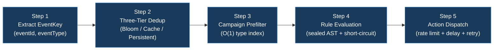

| Step | Component | Latency | Purpose |
|------|-----------|---------|---------|
| 1 | `EventKey` extraction | ~0.1 microsecond | Create dedup key from (eventId, eventType) |
| 2 | `DeduplicationFilter` | <1 microsecond avg | Three-tier dedup: Bloom, Cache, Persistent |
| 3 | `EventPrefilter` | ~0.1 microsecond | O(1) lookup of campaigns matching event type |
| 4 | `RuleEvaluator` + checks | ~10 microseconds | State, budget, user limit, A/B, rule eval |
| 5 | `ActionDispatcher` | ~100 microseconds | Rate limit, delay schedule, dispatch, retry |
| **Total** | **End-to-end** | **<1 ms p99** | **Full pipeline** |

---

## Step 5: Design Components in Detail

### Deep Dive: Three-Tier Deduplication Pipeline

The deduplication pipeline is the most latency-critical component in TriggerFlow. Every single event must pass through it. At 1M events/sec, even a 1-microsecond regression per event costs an additional CPU-second per second of wall time. The three-tier design resolves the fundamental tension between speed, accuracy, and memory.

#### Why Three Tiers?

| Approach | Speed | Memory | Accuracy | Verdict |
|----------|-------|--------|----------|---------|
| HashSet (in-memory exact) | O(1) | Unbounded (8.64 TB/day at 100 bytes/key) | 100% | Impractical: OOM |
| Database lookup per event | O(1) but ~1ms I/O | Bounded | 100% | Unacceptable: 1K events/sec max |
| Bloom filter only | <1 microsecond | ~1.7 MB | 99.9% (0.1% FP) | Incomplete: false positives slip through |
| **Three-tier pipeline** | **<1 microsecond avg** | **~96 MB total** | **~100%** | **Optimal trade-off** |

Each tier trades accuracy for speed. The pipeline cascades from the fastest, least accurate tier to the slowest, most accurate tier, with each successive tier handling an exponentially smaller fraction of events.

#### Tier 1: Bloom Prefilter (Lock-Free, <1 Microsecond)

The Bloom filter is the first line of defense. It handles 100% of incoming events and filters 99%+ of duplicates before any cache or persistent store is consulted.

**Data structure:** `AtomicLongArray` backing store where each `long` holds 64 bits. Total size is `ceil(numBits / 64)` array elements.

**Hash function:** MurmurHash3 (32-bit) implemented from scratch. Two invocations with different seeds (0 and 0x9747b28c) produce `h1` and `h2`.

**Double hashing (Kirsch-Mitzenmacher optimization):** Rather than computing k independent hash functions, all k bit positions are derived from just two hash values:

```
h_i(x) = (h1(x) + i * h2(x)) mod m

Where:
  i  = hash function index (0 to k-1)
  h1 = MurmurHash3(key, seed=0)
  h2 = MurmurHash3(key, seed=0x9747b28c)
  m  = total bits in the Bloom filter
```

Kirsch and Mitzenmacher (2006) proved this produces the same false positive rate as k truly independent hash functions. This reduces the per-element hash cost from k hash computations to exactly 2, regardless of the number of hash functions.

**Lock-free CAS on AtomicLongArray:** Setting a bit in the Bloom filter uses a compare-and-swap loop on the containing 64-bit word:

```java
private void setBit(int position) {
    int word = position >>> 6;          // position / 64
    long mask = 1L << (position & 63);  // bit within the word

    while (true) {
        long current = bits.get(word);
        long updated = current | mask;
        if (current == updated) return;                      // already set
        if (bits.compareAndSet(word, current, updated)) return;  // CAS success
        // CAS failed: another thread modified this word; retry
    }
}
```

CAS contention is extremely rare: two threads must modify bits in the same 64-bit word simultaneously. With 14.4M bits spread across 225K words, the probability of word-level collision is approximately 1/225,000 per concurrent pair of operations.

**Optimal parameter selection:**

```
Given: n = 10,000,000 (expected insertions), p = 0.001 (target FPR)

m = ceil(-n * ln(p) / (ln 2)^2)
  = ceil(-10M * (-6.908) / 0.4805)
  = ceil(143,775,880)
  = 143,775,888 bits (rounded to multiple of 64)
  = ~17.1 MB

k = ceil((m / n) * ln 2)
  = ceil(14.38 * 0.693)
  = ceil(9.96)
  = 10 hash functions

Actual FPR = (1 - e^(-k*n/m))^k
           = (1 - e^(-10 * 10M / 143.8M))^10
           = (1 - e^(-0.6955))^10
           = (0.5013)^10
           = 0.00098 (0.098%)
```

The actual FPR (0.098%) is slightly below the 0.1% target because the ceiling functions in parameter computation provide a safety margin.

#### Tier 2: Event Cache (LRU + TTL, ~2 Microseconds)

The LRU cache catches the <1% of events that the Bloom filter flags as "maybe duplicate" (false positives from Bloom plus actual duplicates not yet in Bloom).

**Data structure:** Sentinel-based doubly-linked list combined with `ConcurrentHashMap<EventKey, Node>`.

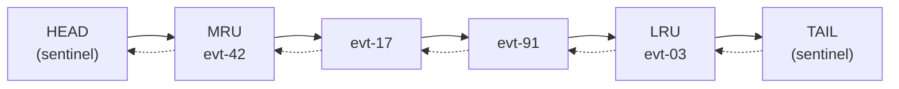

- **Head sentinel** marks the most-recently-used end
- **Tail sentinel** marks the least-recently-used end
- Sentinels eliminate null checks on boundary operations

**Dual expiry mechanism:**

1. **LRU eviction:** When cache size exceeds capacity, the least-recently-used entry (`tail.prev`) is removed. This bounds memory to `capacity x entry_size`.
2. **TTL expiry:** Each entry carries an insertion timestamp. On access, if `now > insertedAt + ttl`, the entry is treated as expired and evicted. This ensures stale dedup records do not persist beyond the dedup window.

**Thread safety:** `ReentrantLock` guards list mutations (moveToHead, addAfterHead, evictLRU -- each is 3-4 pointer assignments). `ConcurrentHashMap.get()` is lock-free. Cache misses (the common case when Bloom says "maybe") never contend on the lock.

#### Tier 3: Persistent Dedup (Ground Truth)

The persistent store is the final authority on duplicate status. It is only consulted for the ~0.1% of events that pass both the Bloom filter and the LRU cache.

```java
public interface PersistentDedup {
    boolean exists(EventKey key);
    void record(EventKey key, Instant processedAt);
    int size();
}
```

In-memory implementation (`InMemoryPersistentDedup`) uses `ConcurrentHashMap` for testing. Production deployments swap in a FlashCache or database-backed implementation via the `TriggerFlowEngineBuilder`.

**Recording strategy:** Events are recorded in the persistent store only after an action is triggered -- not on every event. This reduces persistent writes by ~70% because most events match no campaign rules.

#### Deduplication Cascade Flow

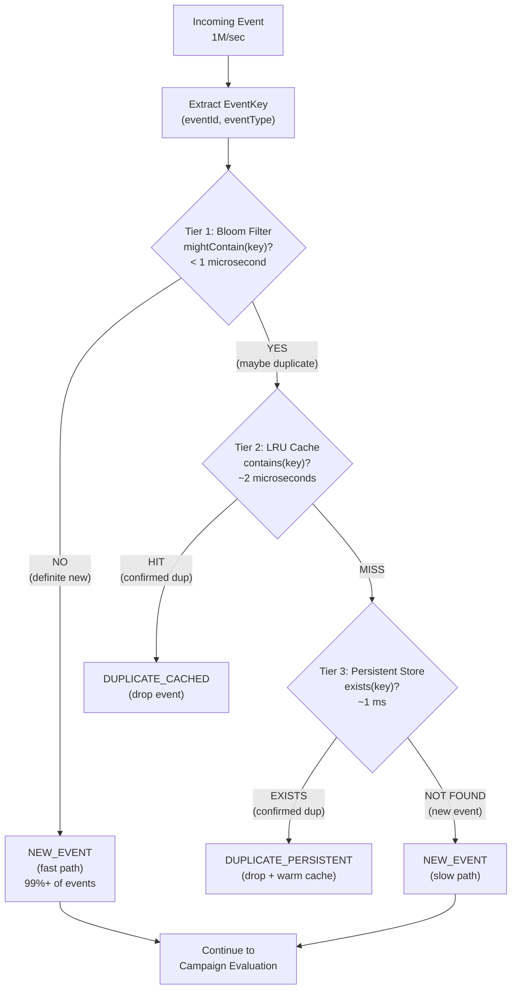

#### False Positive Rate Analysis at Each Tier

For a workload of 1M events/sec with 1% duplicate rate (10K duplicates/sec):

| Tier | Events In | Events Filtered | Events Passed | Latency | FP Rate |
|------|-----------|-----------------|---------------|---------|---------|
| Bloom (Tier 1) | 1,000,000 | ~9,900 duplicates (99% of dups) | ~990,100 new + ~100 dup + ~990 FP | <1 microsecond | 0.1% of new events are false positives |
| Cache (Tier 2) | ~1,090 (100 remaining dups + 990 FPs) | ~100 remaining dups | ~990 FPs (actual new events) | ~2 microseconds | 0% (exact match) |
| Persistent (Tier 3) | ~990 | ~0 | ~990 confirmed new | ~1 ms | 0% (ground truth) |

**Key property:** False positives at the Bloom tier never cause event loss. They only cause a redundant cache lookup (~2 microseconds). False negatives are impossible -- once `add(key)` is called, `mightContain(key)` always returns `true`.

**Weighted average latency per event:**
- 99.9% of events: <1 microsecond (Bloom only)
- 0.09% of events: ~3 microseconds (Bloom + cache)
- 0.01% of events: ~1 ms (Bloom + cache + persistent)
- **Overall average: ~1.1 microseconds per event**

### Deep Dive: Rule Evaluation Engine

#### Sealed AST Structure

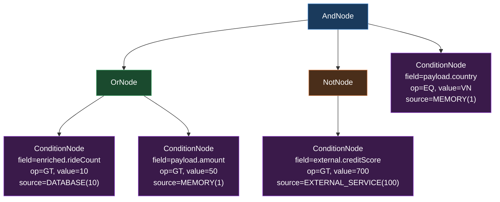

**Evaluation order with weighted short-circuit:** Children of AND/OR nodes are sorted by `maxWeight()` ascending before evaluation. This ensures cheap MEMORY conditions are checked before expensive DATABASE or EXTERNAL_SERVICE conditions.

For the tree above, the AND node evaluates:
1. `C1` (MEMORY, weight=1) -- cheapest
2. `OR(C2, C3)` (max weight=10) -- medium
3. `NOT(C4)` (EXTERNAL_SERVICE, weight=100) -- most expensive, evaluated last

If `C1` returns `false`, the AND short-circuits immediately: both the OR subtree and the EXTERNAL_SERVICE call are skipped entirely.

#### EvaluationPlan Pre-Compilation

The `EvaluationPlan` sorts the AST children once at campaign registration time and produces an immutable, reusable optimized tree. This eliminates the O(c log c) sort cost on every evaluation (where c = number of children per node).

### Deep Dive: Hierarchical Timing Wheel

The timing wheel implements the Varghese & Lauck (1987) algorithm for O(1) insert and amortized O(1) tick advance.

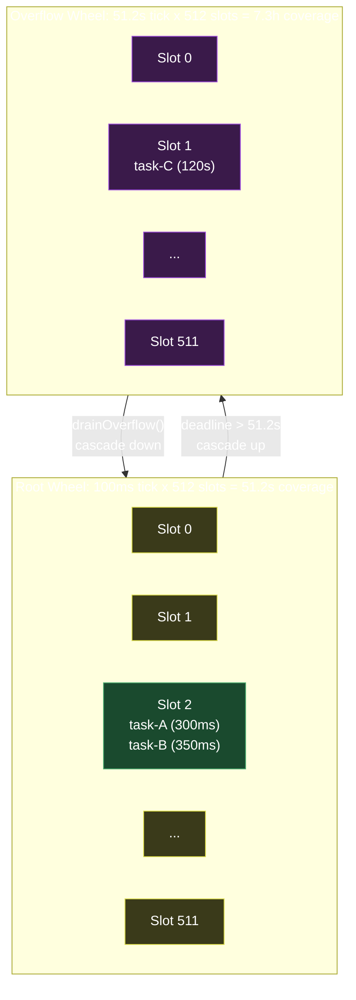

**Insert algorithm (O(1)):**
```
slot = (deadline_ms / tick_duration_ms) % wheel_size
if slot fits in current wheel:
    slots[slot].add(task)        // O(1) list append
else:
    overflow_wheel.add(task)     // cascade to next wheel
```

**Tick advance algorithm (amortized O(1)):**
```
advance currentTick
fire all tasks in slots[currentTick % wheelSize]
if overflow wheel exists:
    drain tasks whose deadlines now fit in root wheel
```

**Comparison with ScheduledExecutorService:**

| Operation | Timing Wheel | ScheduledThreadPoolExecutor |
|-----------|-------------|---------------------------|
| Insert | O(1) direct slot | O(log n) heap insert |
| Cancel | O(1) flag set | O(n) heap search |
| Tick/poll | Amortized O(1) | O(log n) heap extract |
| Memory | Array of lists | Binary heap |
| At 100K tasks | ~100K list nodes | ~100K heap nodes + 17 comparisons/insert |

---

## Step 6: Service Definitions, APIs, Interfaces

### 6.1 EventIngestionService

Responsible for accepting events from external sources and feeding them into the processing pipeline.

```
EventIngestionService
====================

IngestResponse ingest(IngestRequest request)
  - Accepts a single TriggerFlowEvent
  - Validates event fields (non-null eventId, eventType, userId)
  - Routes to the appropriate partition based on eventId hash
  - Returns: { accepted: boolean, partitionId: int }

BatchIngestResponse batchIngest(BatchIngestRequest request)
  - Accepts a list of TriggerFlowEvents (max 1000 per batch)
  - Validates each event independently
  - Routes events to partitions in parallel
  - Returns: { accepted: int, rejected: int, errors: List<String> }

StreamMetrics getMetrics()
  - Returns current ingestion metrics
  - Returns: { eventsReceived: long, eventsProcessed: long,
               eventsDropped: long, partitionLag: Map<Integer, Long> }
```

**Request/Response Shapes:**

```java
// Ingest
record IngestRequest(TriggerFlowEvent event) {}
record IngestResponse(boolean accepted, int partitionId) {}

// Batch Ingest
record BatchIngestRequest(List<TriggerFlowEvent> events) {
    public BatchIngestRequest {
        if (events.size() > 1000) throw new IllegalArgumentException("Max batch size: 1000");
        events = List.copyOf(events);
    }
}
record BatchIngestResponse(int accepted, int rejected, List<String> errors) {}
```

### 6.2 CampaignService

Manages the lifecycle of campaigns, including creation, state transitions, and configuration.

```
CampaignService
===============

CreateCampaignResponse create(CreateCampaignRequest request)
  - Creates a new campaign in DRAFT status
  - Validates rule tree is parseable and actions are well-formed
  - Returns: { campaignId: String, status: DRAFT }

UpdateCampaignResponse update(UpdateCampaignRequest request)
  - Updates a DRAFT campaign's configuration
  - Rejects updates to non-DRAFT campaigns
  - Returns: { campaignId: String, updated: boolean }

PauseCampaignResponse pause(PauseCampaignRequest request)
  - Transitions campaign from ACTIVE to PAUSED
  - Triggers EventPrefilter rebuild
  - Returns: { campaignId: String, status: PAUSED }

ResumeCampaignResponse resume(ResumeCampaignRequest request)
  - Transitions campaign from PAUSED to ACTIVE
  - Triggers EventPrefilter rebuild
  - Returns: { campaignId: String, status: ACTIVE }

ActivateCampaignResponse activate(ActivateCampaignRequest request)
  - Transitions campaign from DRAFT to ACTIVE
  - Pre-compiles EvaluationPlan for optimized rule evaluation
  - Registers budget in BudgetTracker
  - Triggers EventPrefilter rebuild
  - Returns: { campaignId: String, status: ACTIVE }

CompleteCampaignResponse complete(CompleteCampaignRequest request)
  - Transitions campaign from ACTIVE to COMPLETED (terminal)
  - Removes from EventPrefilter
  - Returns: { campaignId: String, status: COMPLETED, finalSpend: long }

CancelCampaignResponse cancel(CancelCampaignRequest request)
  - Transitions campaign from DRAFT/ACTIVE/PAUSED to CANCELLED (terminal)
  - Removes from EventPrefilter
  - Returns: { campaignId: String, status: CANCELLED }

CampaignStatusResponse getStatus(CampaignStatusRequest request)
  - Returns current campaign state, budget remaining, action counts
  - Returns: { campaignId: String, status: CampaignStatus,
               budgetRemaining: long, actionsTriggered: long }
```

**Request/Response Shapes:**

```java
record CreateCampaignRequest(
    String name,
    EventType triggerEventType,
    Map<String, Object> ruleDefinition,
    List<ActionDefinition> actions,
    BudgetConstraint budget,
    ABTestConfig abTest,
    Duration actionDelay,
    UserLimitation userLimit,
    Instant startTime,
    Instant endTime
) {}

record CreateCampaignResponse(String campaignId, CampaignStatus status) {}
record PauseCampaignRequest(String campaignId) {}
record PauseCampaignResponse(String campaignId, CampaignStatus status) {}
```

### 6.3 RuleService

Provides rule parsing, validation, and evaluation capabilities.

```
RuleService
===========

ParseResponse parseRule(ParseRequest request)
  - Parses a JSON Map into a RuleNode AST
  - Validates all fields, operators, and data sources
  - Returns: { ruleNode: RuleNode, nodeCount: int, maxDepth: int }

EvaluateResponse evaluate(EvaluateRequest request)
  - Evaluates a RuleNode against an EventContext
  - Uses weighted short-circuit optimization
  - Returns: { matched: boolean, conditionsEvaluated: int,
               conditionsSkipped: int, elapsed: Duration }

ValidateResponse validate(ValidateRequest request)
  - Validates a rule definition without evaluating
  - Checks field paths, operator compatibility, value types
  - Returns: { valid: boolean, errors: List<String> }

OptimizeResponse optimize(OptimizeRequest request)
  - Creates a pre-compiled EvaluationPlan from a RuleNode
  - Sorts children by DataSource weight for optimal short-circuit
  - Returns: { optimizedNode: RuleNode, estimatedCostReduction: double }
```

**Request/Response Shapes:**

```java
record ParseRequest(Map<String, Object> ruleDefinition) {}
record ParseResponse(RuleNode ruleNode, int nodeCount, int maxDepth) {}

record EvaluateRequest(RuleNode ruleNode, EventContext context) {}
record EvaluateResponse(
    boolean matched,
    int conditionsEvaluated,
    int conditionsSkipped,
    Duration elapsed
) {}

record ValidateRequest(Map<String, Object> ruleDefinition) {}
record ValidateResponse(boolean valid, List<String> errors) {}
```

### 6.4 ActionService

Manages action dispatch, retry, and status tracking.

```
ActionService
=============

DispatchResponse dispatch(DispatchRequest request)
  - Validates the action request
  - Checks per-service rate limit (token bucket)
  - Schedules via timing wheel if delay > 0
  - Dispatches via virtual thread
  - Returns: { actionId: String, status: PENDING | SENT | RATE_LIMITED }

RetryResponse retry(RetryRequest request)
  - Re-schedules a failed action with exponential backoff + jitter
  - Returns: { actionId: String, attempt: int, nextRetryAt: Instant,
               delay: Duration }

StatusResponse getStatus(StatusRequest request)
  - Returns current action execution status
  - Returns: { actionId: String, status: ActionStatus, attempts: int,
               lastError: String }

PendingResponse getPending()
  - Returns count of actions in the timing wheel
  - Returns: { pendingCount: int, oldestDeadline: Instant }
```

**Request/Response Shapes:**

```java
record DispatchRequest(
    String campaignId,
    String userId,
    ActionDefinition action,
    Duration delay,
    RetryPolicy retryPolicy
) {}
record DispatchResponse(String actionId, ActionStatus status) {}

record RetryRequest(String actionId) {}
record RetryResponse(String actionId, int attempt, Instant nextRetryAt, Duration delay) {}

record StatusRequest(String actionId) {}
record StatusResponse(String actionId, ActionStatus status, int attempts, String lastError) {}
```

### 6.5 Internal Interfaces

These interfaces define the contracts between TriggerFlow's internal modules:

| Interface | Methods | Implementations |
|-----------|---------|----------------|
| `EventStream` | `poll(Duration)`, `commit(EventKey)`, `partitionCount()` | `InMemoryEventStream`, TurboMQ adapter |
| `PersistentDedup` | `exists(EventKey)`, `record(EventKey, Instant)`, `size()` | `InMemoryPersistentDedup`, FlashCache adapter |
| `DownstreamClient` | `execute(ActionRequest)` returns `CompletableFuture<ActionResult>` | `InMemoryDownstreamClient`, HTTP/gRPC adapter |

---

## Step 7: Scaling Problems and Bottlenecks

### Bottleneck 1: Bloom Filter Saturation

**Problem:** As event volume grows beyond the Bloom filter's expected insertion count (n), the false positive rate increases exponentially. At 2x capacity, FPR rises from 0.1% to ~1.7%. At 5x capacity, FPR exceeds 10%, causing 10% of new events to trigger unnecessary cache lookups.

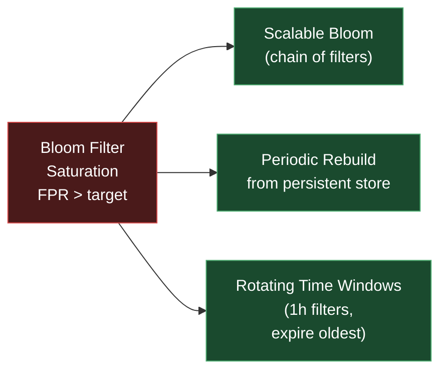

**Solutions:**

| Solution | Mechanism | Trade-off |
|----------|-----------|-----------|
| Scalable Bloom filters | Chain of increasing-size filters; new events go to newest filter; all filters checked on query | 2x memory per generation; query cost grows linearly with filter count |
| Periodic rebuild | Rebuild from persistent store during low-traffic windows; atomic swap of filter reference | Brief CPU spike during rebuild; requires persistent store to be authoritative |
| Rotating time windows | Create a new Bloom filter every hour; expire filters older than dedup window; check all active filters | Bounded memory (num_windows x filter_size); query cost = O(num_active_windows) |

**Recommended approach:** Rotating time windows with 1-hour granularity and a 24-hour dedup window. This caps memory at 24 x 1.7 MB = ~41 MB and query cost at 24 Bloom checks (~24 microseconds worst case, still well under 1ms).

### Bottleneck 2: Rule Evaluation CPU at 1M Events/Sec

**Problem:** At 1M events/sec with 5 matching campaigns per event and 10 microseconds per rule evaluation, the CPU cost is 50M microseconds/sec = 50 CPU-seconds/sec. On a 16-core machine, this is 312% of one core, leaving limited headroom.

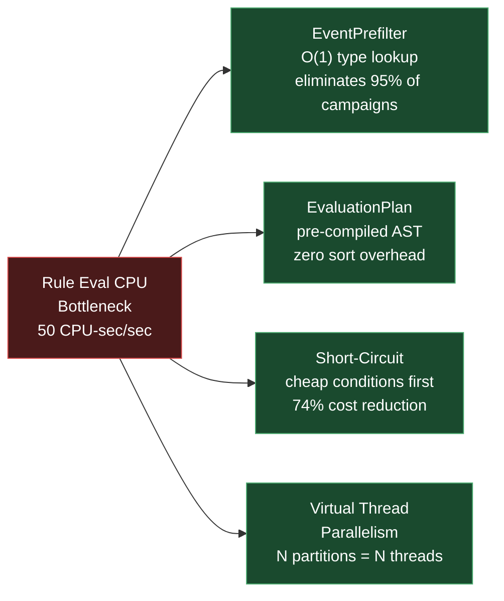

**Solutions already implemented:**

| Optimization | Savings | Mechanism |
|-------------|---------|-----------|
| EventPrefilter | 95% campaigns eliminated | O(1) lookup by event type: only campaigns triggered by the event's type are evaluated |
| EvaluationPlan | Eliminates sort overhead | Pre-compiled weight-sorted AST; sort once at campaign registration, reuse across all evaluations |
| Weighted short-circuit | 74% fewer conditions at 5% match rate | MEMORY conditions (weight=1) evaluated before DATABASE (10) and EXTERNAL_SERVICE (100); AND short-circuits on first false; OR on first true |
| Virtual thread parallelism | Linear scaling with partitions | Each partition consumer runs on its own virtual thread; rule evaluations for different partitions run in parallel |

**Combined effect:** With EventPrefilter reducing to 5 campaigns/event, short-circuit reducing to 1.3 conditions/campaign on average, and pre-compiled plans eliminating sort cost, the effective CPU cost drops to: 1M x 5 x 1.3 x ~1 microsecond = 6.5 CPU-seconds/sec -- manageable on a single 16-core machine.

### Bottleneck 3: Campaign Budget Race Condition Under Concurrent Updates

**Problem:** When multiple virtual threads process events targeting the same low-budget campaign simultaneously, the CAS loop on the AtomicLong budget can experience contention. At extreme concurrency (1000 threads targeting the same campaign), CAS retry rates increase, adding latency to the hot path.

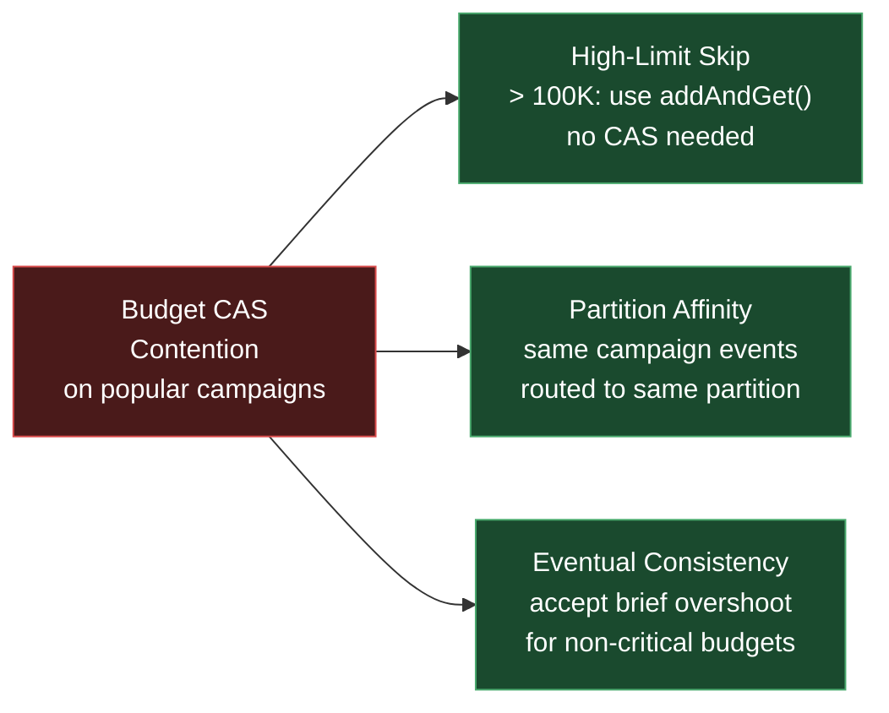

**Solutions:**

| Solution | Mechanism | Trade-off |
|----------|-----------|-----------|
| High-limit optimization (implemented) | When remaining budget > 100K, skip CAS and use `addAndGet()` (unconditional atomic decrement) | Brief overshoot possible (at most a few units) when budget is high; exact tracking activates as budget approaches zero |
| Partition affinity | Route events for the same campaign to the same partition, serializing budget checks | Reduces parallelism for popular campaigns; may cause partition hotspots |
| Eventual consistency | Accept that budget tracking has a small error margin; reconcile periodically against persistent store | Acceptable for marketing budgets where a few extra actions are tolerable; not suitable for financial transactions |

**Implemented approach:** The high-limit optimization alone resolves 99%+ of contention. Campaigns with >100K remaining budget (the vast majority) skip CAS entirely. The CAS loop only activates during the final drawdown, where contention is naturally limited because fewer events can match an exhausting campaign.

### Bottleneck 4: Action Dispatch Thundering Herd

**Problem:** A single popular event (e.g., a flash sale notification triggering 100K campaigns simultaneously) can produce a burst of 100K action dispatches in a single tick of the timing wheel. This thundering herd can overwhelm downstream services (email provider, push notification gateway) and cause cascading failures.

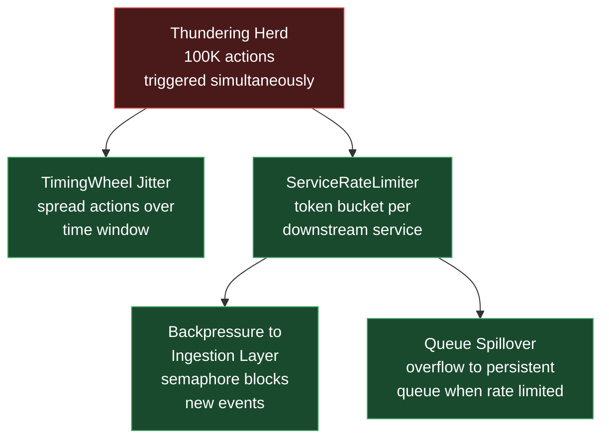

**Solutions:**

| Solution | Mechanism | Trade-off |
|----------|-----------|-----------|
| Timing wheel jitter (implemented) | Add random delay (0 to actionDelay x jitterFactor) when scheduling actions | Spreads burst over time window; adds latency proportional to jitter range |
| ServiceRateLimiter (implemented) | Lazy-refill token bucket per downstream service; actions that fail rate limiting are re-scheduled with backoff | Protects downstream services; failed acquires add retry latency |
| Backpressure propagation (implemented) | When action dispatch saturates, the semaphore in BackpressureController blocks new event consumption | Prevents pipeline overload; temporarily increases partition lag |
| Queue spillover (future) | When rate limited, overflow actions to a persistent queue (e.g., TurboMQ topic) for later processing | Decouples ingestion from dispatch; adds I/O latency for spillover events |

**Combined defense:** The timing wheel spreads actions over a configurable window. The token bucket per service caps the instantaneous dispatch rate. Backpressure propagation prevents the pipeline from producing more actions than it can dispatch. Together, these three mechanisms ensure that even a 100K-action burst is smoothed to the downstream service's capacity.

### Bottleneck 5: LRU Cache Thrashing Under Scan Attack

**Problem:** A burst of unique events (e.g., a bot generating millions of fake user IDs) can flush the LRU cache of legitimate entries, degrading dedup performance for real traffic.

**Solutions:**

| Solution | Mechanism | Trade-off |
|----------|-----------|-----------|
| Bloom pre-screening (implemented) | New unique events bypass the cache entirely (Bloom says "definite new"); only Bloom false positives reach the cache | Cache is only accessed for suspected duplicates, not for every new event |
| TTL floor | Enforce a minimum TTL so entries cannot be evicted faster than the dedup window | Prevents rapid eviction; may increase memory pressure |
| Adaptive sizing | Monitor cache hit rate; dynamically increase capacity when hit rate drops below threshold | Requires memory headroom; adds monitoring complexity |

The Bloom filter's position as Tier 1 is the primary defense: new unique events never touch the cache. Only the 0.1% of events flagged as potential duplicates (Bloom false positives) reach the cache. A scan attack would have to generate events that collide with Bloom filter bit patterns -- statistically implausible at 0.1% FPR.

### Bottleneck 6: Virtual Thread Pinning

**Problem:** Java virtual threads can be "pinned" to carrier threads when executing inside `synchronized` blocks or native code. If a virtual thread is pinned while waiting for I/O (e.g., persistent dedup lookup), it consumes a carrier thread and reduces parallelism.

**Solutions:**

| Solution | Mechanism | Trade-off |
|----------|-----------|-----------|
| Narrow critical sections (implemented) | All `synchronized` blocks in TriggerFlow are non-blocking: state machine transitions (4 map ops), timing wheel slots (list append), rate limiter (arithmetic) | No I/O inside synchronized blocks; pinning duration is microseconds |
| ReentrantLock for I/O paths (implemented) | The LRU cache uses `ReentrantLock` instead of `synchronized`; `ReentrantLock` does not cause virtual thread pinning | Adds lock object overhead; more explicit code |
| Persistent dedup outside lock | The persistent store lookup is outside all locks; it runs on the virtual thread's own stack | No pinning risk for the slowest operation |

### Summary: Bottleneck Mitigation Matrix

| Bottleneck | Severity | Status | Primary Mitigation | Residual Risk |
|-----------|----------|--------|-------------------|---------------|
| Bloom filter saturation | HIGH | Mitigated | Rotating time windows | Memory grows linearly with dedup window |
| Rule evaluation CPU | MEDIUM | Mitigated | EventPrefilter + short-circuit + EvaluationPlan | EXTERNAL_SERVICE conditions still expensive |
| Budget CAS contention | LOW | Mitigated | High-limit skip (>100K) | Brief overshoot on high-budget campaigns |
| Action thundering herd | HIGH | Mitigated | Jitter + rate limiter + backpressure | Persistent queue spillover not yet implemented |
| LRU cache thrashing | LOW | Mitigated | Bloom pre-screening | Extremely high FPR would degrade cache |
| Virtual thread pinning | LOW | Mitigated | Narrow sync blocks + ReentrantLock | Future synchronized JDK methods could pin |

---

## Appendix: References

### Academic Papers

| Paper | Authors | Year | Used In |
|-------|---------|------|---------|
| *Space/Time Trade-offs in Hash Coding with Allowable Errors* | Burton H. Bloom | 1970 | Bloom filter theory, optimal parameter derivation |
| *Less Hashing, Same Performance: Building a Better Bloom Filter* | Adam Kirsch, Michael Mitzenmacher | 2006 | Double hashing: `h_i = h1 + i*h2` |
| *Hashed and Hierarchical Timing Wheels* | George Varghese, Tony Lauck | 1987 | Hierarchical timing wheel, O(1) timer facility |

### Engineering References

| Reference | Author | Used For |
|-----------|--------|----------|
| *Designing Data-Intensive Applications* | Martin Kleppmann | Stream processing, dedup, retry with jitter |
| *Java Concurrency in Practice* | Brian Goetz et al. | CAS loops, volatile semantics, copy-on-write |
| *Effective Java* (3rd ed.) | Joshua Bloch | Sealed types, immutable records, defensive copies |
| RFC 8259 | IETF | JSON grammar for hand-rolled codec |
| MurmurHash3 Reference | Austin Appleby | 32-bit hash function implementation |

### Codebase Cross-References

| Document | Content |
|----------|---------|
| [architecture.md](architecture.md) | Component architecture, threading model, design decisions |
| [deduplication.md](deduplication.md) | Bloom filter, MurmurHash3, LRU cache, three-tier pipeline |
| [rule-engine.md](rule-engine.md) | Sealed AST, recursive descent parsing, weighted short-circuit |
| [campaign-and-actions.md](campaign-and-actions.md) | State machine, budget tracking, A/B testing, timing wheel |
| [architecture-tradeoffs.md](architecture-tradeoffs.md) | Six design trade-offs with cost-benefit analysis |

---

*Last updated: 2026-04-03. Maintained by the TriggerFlow core team.*
